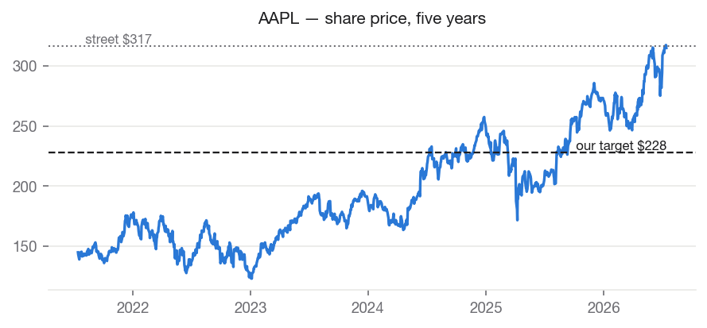
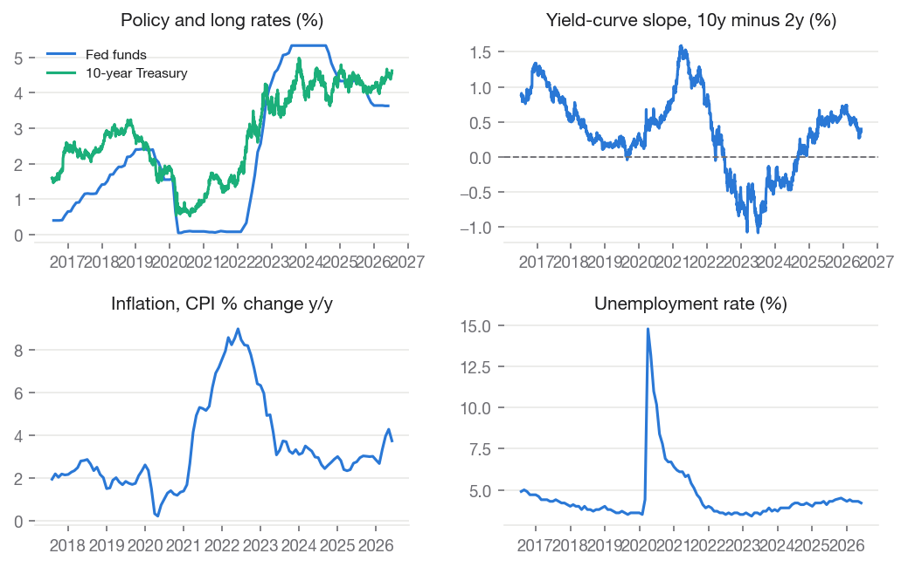
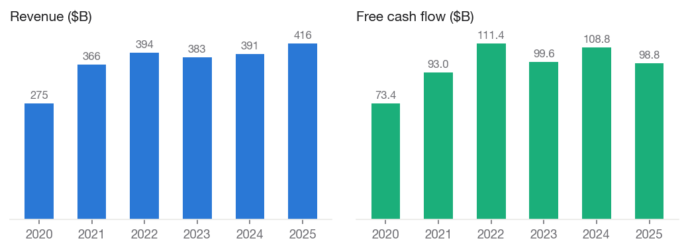
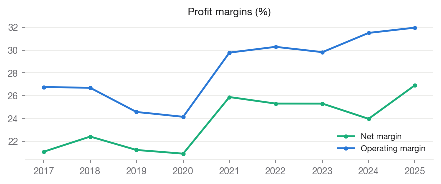
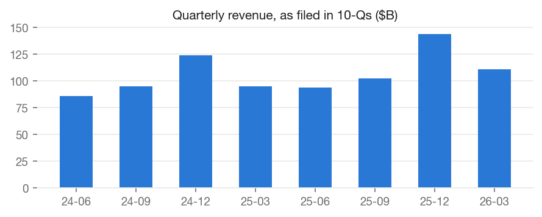
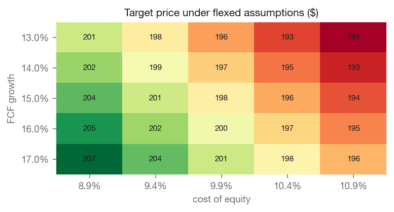

# Apple Inc. (AAPL) — SELL

**Equity Research | Technology — Consumer Electronics | 2026-07-14**

| | |
|---|---|
| Rating (absolute) | **SELL** |
| Rating (relative, within coverage) | **Least Preferred** (#5 of coverage) |
| Price | $314.86 |
| Target price | **$227.98** (base model $198.25) |
| Implied upside | -27.6% |
| Street consensus target | $316.76 (42 analysts) |
| Market cap | $4,624.5B |
| 52-week range | $201.50 – $323.45 |
| Beta | 1.097 |
| Dividend yield | 0.34% |
| Institutional ownership | 65.7% |

## Investment Summary

We rate AAPL **SELL** with a price target of **$227.98**, against a current price of $314.86 (-27.6% implied return). Within our coverage universe, the name ranks **Least Preferred**.

The target blends independent valuation lenses: discounted cash flow values the shares at $152.53; peer comparables values the shares at $190.33; own historical multiple values the shares at $267.11.

**Analyst overlay (2026-07-03, +15.0%):** Partial credit for AI services optionality that the base engine, by design, refuses to price. Street consensus embeds a full AI-gateway narrative (estimated at up to $15B per year of services revenue long-term, per Wedbush); pricing that narrative's cash flows directly supports roughly $15-20 per share, probability-weighted. We credit approximately that arithmetic value and no more - the services opportunity is real but unproven, and hardware replacement-cycle acceleration remains speculative. Confirmed by analyst review, 2026-07-08. *(Review by 2026-10-30.)*

Our target sits -28.0% vs. street consensus of $316.76. The divergence is our documented view, not an input: consensus never enters the models.

## The Investment Thesis

Apple is the finest consumer franchise of its generation, and that is not
the question. The question is what an investor is being asked to pay for
it. At roughly 38x trailing earnings, the market prices Apple not only far
above its large-cap technology peers (median near 23x) but well above
Apple's own five-year average of about 28x — a premium to its own premium.

What has changed to justify that re-rating? Not the delivered numbers.
Revenue grew 6% in fiscal 2025, a solid recovery from the flat 2022-2024
stretch, but hardly hypergrowth: the five-year revenue compound rate is
8.7%, and free cash flow has compounded at roughly 6%. What has changed is
a story — that Apple will become the default gateway through which two
billion consumers meet artificial intelligence, monetized through its
services layer.

We are not dismissive of that story; we credit it explicitly. Priced as
cash flows, the visible version of the AI-services opportunity (industry
estimates cluster around $15 billion of eventual annual services revenue)
supports roughly $15-20 per share, probability-weighted — and our target
includes a disclosed +15% analyst overlay that grants approximately that
value. What we decline to pay for is the remaining, much larger portion of
the premium, which requires the narrative to work *spectacularly* rather
than merely well.

All three of our valuation lenses sit below the market price — discounted
cash flow at $153, peer comparables at $191, and, most tellingly, Apple's
own historical multiple at $267. When even the lens that grants Apple its
full historical premium cannot reach the current price, the residual is
narrative, not value. We rate the shares SELL with a $229 target,
acknowledging plainly that this is a valuation call, not a quality call:
nothing in the filings suggests a deteriorating business — only an
expensive one.

## Macro & Industry Overview

**Economic backdrop (FRED, latest readings):**

| Indicator | Latest | As of | 1y ago | Change |
|---|---|---|---|---|
| Effective Federal Funds Rate (%) | 3.63 | 2026-06-01 | 4.33 | -0.70 |
| 10-Year Treasury Yield (%) | 4.62 | 2026-07-13 | 4.43 | +0.19 |
| 10Y-2Y Treasury Spread (%) | 0.40 | 2026-07-14 | 0.53 | -0.13 |
| Consumer Price Index (level) | 332.57 | 2026-06-01 | 321.44 | +11.13 |
| Unemployment Rate (%) | 4.20 | 2026-06-01 | 4.10 | +0.10 |
| U. Michigan Consumer Sentiment | 44.80 | 2026-05-01 | 52.20 | -7.40 |
| Personal Consumption Expenditures ($B) | 22,059.80 | 2026-05-01 | 20,755.00 | +1,304.80 |

Cost of equity: **9.90%** (10Y Treasury 4.62% risk-free base, CAPM).

**Macro linkages applied to this valuation** (rule-based, capped; see MACRO_CATALOG.md):

- **credit_spread_erp** [BAA10Y] — Baa spread 1.56%, -0.41pp vs 10y median. Adjustment: -0.20% to cost_of_equity. Credit spreads are a market-priced risk gauge; wider-than-normal spreads raise the equity risk premium.
- **dollar_translation** [DTWEXBGS] — Trade-weighted dollar +0.6% y/y. Adjustment: -0.10% to growth. ~58% of revenue is foreign; a stronger dollar shrinks it in translation, a weaker one inflates it.
- **durables_demand** [PCEDG] — Durables spending +5.7% y/y vs +6.2% 5y trend. Adjustment: -0.15% to growth. Premium devices are durable-goods purchases; demand running above/below trend leans on near-term growth.

## Business Description

Apple Inc. designs, manufactures, and markets smartphones, personal computers, tablets, wearables, and accessories worldwide. The company offers iPhone, a line of smartphones; Mac, a line of personal computers; iPad, a line of multi-purpose tablets; and wearables, home, and accessories comprising AirPods, Apple Vision Pro, Apple TV, Apple Watch, Beats products, and HomePod, as well as Apple branded and third-party accessories. It also provides AppleCare support and cloud services; and operates various platforms, including the App Store that allows customers to discover and download applications and digital content, such as books, music, video, games, and podcasts, as well as advertising services include third-party licensing arrangements and its own advertising platforms. In addition, the company offers various subscription-based services, such as Apple Arcade, a game subscription service; Apple Fitness+, a personalized fitness service; Apple Music, which offers users a curated listening experience with on-demand radio stations; Apple News+, a subscription news and magazine service; Apple TV, which offers original content and live sports; Apple Card, a co-branded credit card; and Apple Pay, a cashless payment service, as well as licenses its intellectual property. The company serves consumers, and small and mid-sized businesses; and the education, enterprise, and government markets. It distributes third-party applications for its products through the App Store. The company also sells its products through its retail and online stores, and direct sales force; and third-party cellular network carriers and resellers. The company was formerly known as Apple Computer, Inc. and changed its name to Apple Inc. in January 2007. Apple Inc. was founded in 1976 and is headquartered in Cupertino, California.

### Segments and revenue drivers

Apple's fiscal 2025 revenue of $416.2 billion divides into five reported
categories:

| Segment | FY2025 revenue | Share | Growth y/y |
|---|---|---|---|
| iPhone | $209.6B | 50% | +4% |
| Services | $109.2B | 26% | +14% |
| Wearables, Home & Accessories | $35.7B | 9% | −4% |
| Mac | $33.7B | 8% | +12% |
| iPad | $28.0B | 7% | +5% |

Two structural facts matter more than the individual growth rates. First,
**the iPhone is still half the company.** Every other business — including
Services — ultimately draws its economics from the installed base of
iPhones; a weak iPhone cycle transmits directly into services attach rates
and accessory sales over time. Second, **Services is the only segment
growing at a double-digit rate, and it carries roughly twice the gross
margin of hardware.** The investment debate is therefore really a mix-shift
debate: how fast can a 26%-of-revenue, high-margin annuity outgrow a
50%-of-revenue, maturing hardware business? At current relative growth
rates, Services adds roughly one to two points of revenue share per year —
meaningful, but a decade-scale transition, not a two-year one.

## Industry Overview and Competitive Positioning

The global smartphone industry is mature. Unit volumes have oscillated
around 1.2 billion per year for nearly a decade, replacement cycles have
lengthened as devices improved, and effectively all industry profit accrues
to the premium tier — where Apple holds a commanding share of units and an
overwhelming share of economics. Growth in this industry is now won through
price (mix migration toward Pro models), attach (services and accessories
per device), and cycle timing (features compelling enough to shorten
replacement intervals) rather than through unit expansion.

Competitively, Apple faces pressure from two directions. In hardware,
Samsung and the leading Chinese manufacturers (Huawei's resurgence in the
domestic Chinese market is the most consequential) compete aggressively on
specification and price; China remains Apple's most exposed major market,
combining local competition, national-champion sentiment, and geopolitical
tail risk. In platforms, the deeper long-term threat is architectural:
if conversational AI assistants become the primary interface through which
consumers accomplish tasks, the smartphone's app-grid model — and the App
Store toll booth built on it — could matter less. Apple's slow rollout of
its own AI capabilities, including repeated delays to the revamped Siri,
is the source of both the bear case (Apple is behind) and the bull case
(Apple's two-billion-device distribution means it need only be adequate,
not first).

A regulatory overhang runs through all of it. The economics of Services
include an estimated $20+ billion annual payment from Google for search
default placement — revenue with essentially no associated cost — which
remains subject to ongoing antitrust litigation and appeal. European
regulation (the Digital Markets Act) has already forced alternative app
distribution in the EU, chipping at App Store economics at the margin.
None of these individually breaks the franchise; collectively they cap the
multiple a disciplined buyer should pay for the services annuity.

### The moat — durability of the franchise

Apple's moat is real and, in our judgment, among the widest in global
business. It rests on four reinforcing layers: **ecosystem switching
costs** (a user's photos, messages, purchases, subscriptions, and habits
make leaving costly in time and friction, not just money); **brand pricing
power** (Apple sustains average selling prices multiples above industry
norms without measurable share loss); **vertical silicon integration**
(designing its own chips yields performance-per-watt advantages competitors
cannot buy off the shelf); and **the App Store's two-sided network**,
where developers must be present because users are, and vice versa.

The honest question is not whether the moat exists but whether it is
widening or narrowing. We see it as stable-to-slightly-narrowing: the
switching-cost and silicon layers remain formidable, while the App Store
layer faces regulatory erosion and the brand layer is untested against a
generational interface shift toward AI assistants. A stable moat justifies
a premium multiple; it does not justify an *expanding* one, which is what
the current share price implicitly assumes.

## Financial Analysis

Annual figures from SEC EDGAR as-filed XBRL data (10-K).

| Fiscal year | Revenue | Net margin | Op margin | ROE | Free cash flow |
|---|---|---|---|---|---|
| 2020 | $274.5B | +20.9% | +24.1% | +87.9% | $73.4B |
| 2021 | $365.8B | +25.9% | +29.8% | +150.1% | $93.0B |
| 2022 | $394.3B | +25.3% | +30.3% | +197.0% | $111.4B |
| 2023 | $383.3B | +25.3% | +29.8% | +156.1% | $99.6B |
| 2024 | $391.0B | +24.0% | +31.5% | +164.6% | $108.8B |
| 2025 | $416.2B | +26.9% | +32.0% | +151.9% | $98.8B |

Revenue CAGR: +1.8% (3y), +8.7% (5y). Net income CAGR (5y): +14.3%. FCF CAGR (5y): +6.1%.

### Recent quarters

| Quarter ended | Revenue | Net income | Diluted EPS |
|---|---|---|---|
| 2024-06-29 | $85.8B | $21.4B | $1.40 |
| 2024-09-28\* | $94.9B | $14.7B | — |
| 2024-12-28 | $124.3B | $36.3B | $2.40 |
| 2025-03-29 | $95.4B | $24.8B | $1.65 |
| 2025-06-28 | $94.0B | $23.4B | $1.57 |
| 2025-09-27\* | $102.5B | $27.5B | — |
| 2025-12-27 | $143.8B | $42.1B | $2.84 |
| 2026-03-28 | $111.2B | $29.6B | $2.01 |

\* Fiscal fourth quarters have no 10-Q of their own; they are derived as the annual filing less the three reported quarters. Quarterly EPS is not derived.

## Management and Capital Allocation

Apple's management under Tim Cook has been defined less by product
revolution than by operational and financial excellence: supply-chain
mastery, disciplined pricing, and the most shareholder-friendly capital
return program in corporate history. The company returns effectively all
free cash flow to owners, retiring roughly 3% of its shares each year —
around $100 billion annually in buybacks — under a stated policy of
reaching net-cash neutrality over time. Two implications follow for
investors. First, per-share value compounds faster than company-level
figures suggest; our models do not yet credit this (a disclosed limitation
scheduled for correction), which is worth roughly a mid-single-digit
percentage on our target. Second, the buyback is price-insensitive —
Apple repurchases at 38x earnings as readily as at 15x — so shareholders
should not read the program as a signal of management's view on valuation.

R&D spending, at roughly 8% of revenue, is high in dollars but middling as
a ratio for big tech; Apple's innovation model concentrates spend on fewer,
longer-cycle bets (silicon, health, spatial computing, and now AI) rather
than a portfolio of moonshots. Acquisitions remain small tuck-ins; the
balance sheet remains a fortress. We assess capital allocation as
excellent, with the sole caveat that a management returning all cash to
shareholders is also telling you it sees no better internal use for it —
an implicit admission about the scarcity of large growth opportunities.

## Valuation

Each lens values the company independently; sharp disagreement between them is itself information. Weights: discounted cash flow 40%, peer comparables 30%, own historical multiple 30%.

### Discounted cash flow — $152.53 per share

| Assumption | Value |
|---|---|
| Fcf base | $99.6B |
| Initial growth | 15.00% |
| Terminal growth | 2.50% |
| Cost of equity | 9.90% |
| Exit multiple | 23.82 |
| Projection years | 5.00 |
| Net debt | $42.4B |
| Fcf basis | operating cash flow less all capital expenditure (standard basis) |
| Capex to depreciation | 0.96x |

### Peer comparables — $190.33 per share

| Assumption | Value |
|---|---|
| Trailing | eps 8.25; peer median pe 22.95 |
| Forward | eps 9.62; peer median pe 19.88 |
| Peers used | MSFT, GOOGL, DELL, HPQ, SONY |

### Own historical multiple — $267.11 per share

| Assumption | Value |
|---|---|
| Own avg pe 5y | 27.76 |
| Eps used | 9.62 |
| Eps basis | forward |

**Sensitivity — target price across FCF growth (rows) and cost of equity (columns):**

| FCF growth | 8.9% | 9.4% | 9.9% | 10.4% | 10.9% |
|---|---|---|---|---|---|
| 13.0% | 201 | 198 | 196 | 193 | 191 |
| 14.0% | 202 | 199 | 197 | 195 | 193 |
| 15.0% | 204 | 201 | 198 | 196 | 194 |
| 16.0% | 205 | 202 | 200 | 197 | 195 |
| 17.0% | 207 | 204 | 201 | 198 | 196 |

### DCF walk — the projection, year by year

The base free cash flow of $99.6B is measured as operating cash flow less all capital expenditure (standard basis). Growth fades from 15.0% toward 2.5%, and each year is discounted at 9.90%.

| Year | Growth | Free cash flow | Discount factor | Present value |
|---|---|---|---|---|
| 1 | +15.0% | $114.5B | 0.910 | $104.2B |
| 2 | +11.9% | $128.1B | 0.828 | $106.1B |
| 3 | +8.8% | $139.3B | 0.753 | $105.0B |
| 4 | +5.6% | $147.2B | 0.686 | $100.9B |
| 5 | +2.5% | $150.8B | 0.624 | $94.1B |

- Sum of explicit-period value: $510.2B
- Terminal value: average of Gordon growth ($2,089.5B) and exit multiple ($3,593.7B), discounted to $1,772.4B (78% of total value)
- Less net debt $42.4B → equity value $2,240.3B → **$152.53 per share**

### Comparable companies

| Company | Mkt cap | P/E (ttm) | P/E (fwd) | EV/EBITDA | P/B | Net margin | ROE |
|---|---|---|---|---|---|---|---|
| **AAPL (subject)** | $4,624.5B | 38.2 | 32.7 | — | 43.4 | — | — |
| Microsoft Corporation | $2,859.4B | 23.0 | 19.9 | 15.8 | 6.9 | 39.3% | 34.0% |
| Alphabet Inc. | $4,386.9B | 27.4 | 24.6 | 26.3 | 9.1 | 37.9% | 38.9% |
| Dell Technologies Inc. | $295.6B | 36.4 | 21.3 | 21.1 | -211.5 | 6.3% | — |
| HP Inc. | $22.5B | 9.1 | 8.2 | 6.3 | -156.9 | 4.4% | — |
| Sony Group Corporation | $122.1B | 19.6 | 17.5 | 0.0 | 2.5 | -2.6% | 12.3% |

Medians of this table drive the peer-comps lens and the DCF exit multiple. Peer selection is disclosed in universe.py and versioned.

## Catalysts and What Would Change Our Mind

Dated events and evidence that would move the stock — and, separately,
what would change *our* position:

- **Quarterly earnings (next report expected late July 2026).** The single
  metric we watch is Services growth: sustained prints at or above ~14%
  keep the mix-shift thesis on schedule; deceleration toward single digits
  undermines the one segment carrying the growth story.
- **The AI feature cycle.** Concrete evidence that Apple Intelligence and
  the delayed Siri overhaul drive either shortened iPhone replacement
  cycles or paid services attach would be the first cash-flow validation
  of the AI-gateway narrative. We would raise our overlay on evidence of
  monetization, not on demonstrations.
- **Regulatory rulings.** An adverse final outcome on the Google default-
  placement payments would remove a high-margin revenue stream worth
  several points of EPS; our target does not assume that loss, so the risk
  runs downward from here.
- **China trajectory.** Stabilization or share recovery against domestic
  competitors would de-risk roughly a fifth of revenue.
- **What flips our rating.** Our SELL is a valuation call, so it reverses
  through either channel: the price falling toward our $229 target, or
  delivered earnings growth (not multiple expansion) closing the gap —
  concretely, a return to sustained double-digit revenue growth with
  Services holding mid-teens, which would lift all three lenses
  materially. We pre-commit to reviewing the rating on any quarter that
  delivers both.

## Investment Risks

- Durable-goods demand is cyclical and replacement cycles can extend when consumers are stretched.
- Currency: ~58% of revenue is earned abroad; a strengthening dollar is a mechanical translation headwind.
- Valuation model risk: 78% of DCF value sits in the terminal period — the estimate is sensitive to terminal assumptions, as the sensitivity grid shows.
- Against-consensus risk: our rating is below street consensus; if the narrative premium we decline to pay for is validated by delivered earnings, the stock can continue to outperform our target.

## ESG & Governance

Free primary ESG data is limited; this section reports only what can be grounded in market and filing data, and flags sector-specific exposures qualitatively.

- Institutional ownership: 66% — professional holders with governance voting power.
- Public float: 100% of shares outstanding.
- Dividend record: cash returned to shareholders in each of the last 13 fiscal years on file — a capital-discipline signal.
- Environmental/social exposure: hardware supply chains (sourcing, labor, e-waste) are the material themes for device makers.

## Disclosures

- Generated by Equity-Lens on 2026-07-14 from primary sources: SEC EDGAR (as-filed XBRL financials), Yahoo Finance (market data), FRED (macro series).
- All model values are computed deterministically; methodology is versioned in this repository. Analyst overlays are dated and disclosed in the Investment Summary.
- Street consensus figures are shown for benchmarking only and are never model inputs.
- Educational research project. Not investment advice.
