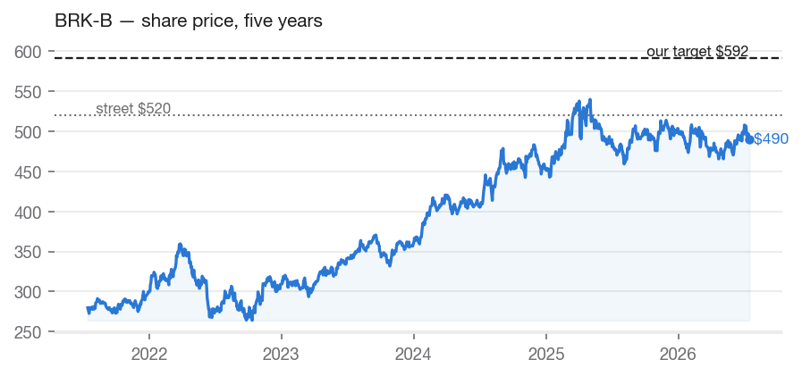
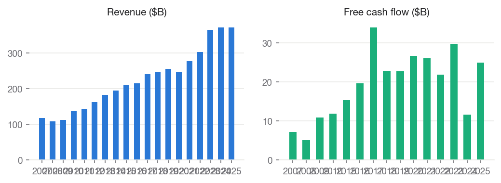
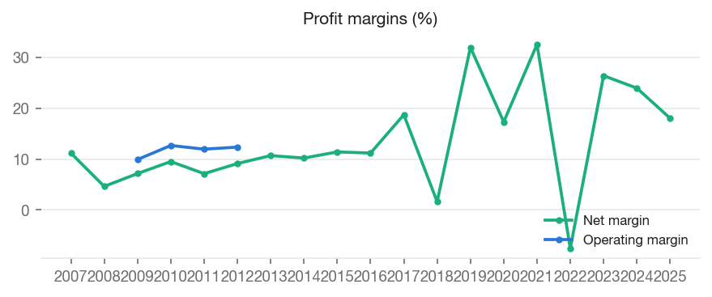
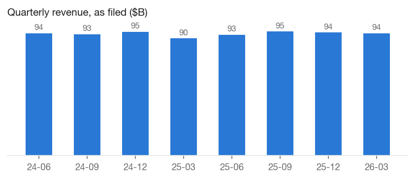
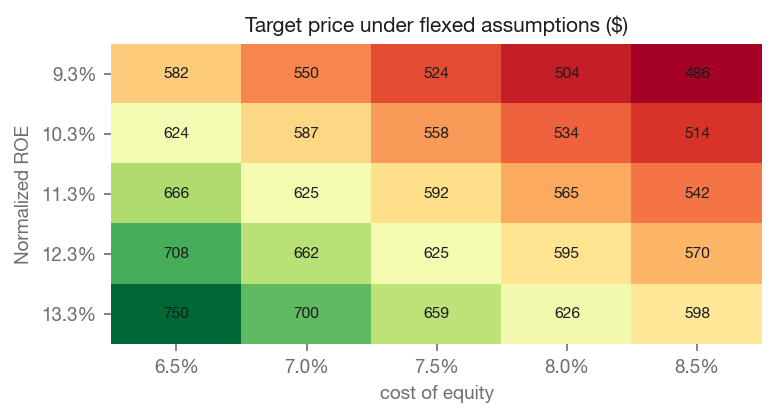

# Berkshire Hathaway Inc. (BRK-B) — BUY

**Equity Research | Financials — Diversified Holdings / Insurance | 2026-07-15**

| | |
|---|---|
| Rating (absolute) | **BUY** |
| Rating (relative, within coverage) | **Overweight** (#3 of coverage) |
| Price | $489.92 |
| Target price | **$591.66** (base model $591.66) |
| Implied upside | +20.8% |
| Street consensus target | $520.33 (3 analysts) |
| Market cap | $1,056.7B |
| 52-week range | $455.19 – $516.85 |
| Beta | 0.607 |
| Dividend yield | n/a |
| Institutional ownership | 67.3% |

## Investment Summary

We rate BRK-B **BUY** with a price target of **$591.66**, against a current price of $489.92 (+20.8% implied return). Within our coverage universe, the name ranks **Overweight**.

The target blends independent valuation lenses: justified price-to-book values the shares at $589.37; peer price-to-book values the shares at $593.96.

Our target sits +13.7% vs. street consensus of $520.33. The divergence is our documented view, not an input: consensus never enters the models.

## Macro & Industry Overview

**Economic backdrop (FRED, latest readings):**

| Indicator | Latest | As of | 1y ago | Change |
|---|---|---|---|---|
| Effective Federal Funds Rate (%) | 3.63 | 2026-06-01 | 4.33 | -0.70 |
| 10-Year Treasury Yield (%) | 4.62 | 2026-07-13 | 4.43 | +0.19 |
| 10Y-2Y Treasury Spread (%) | 0.40 | 2026-07-14 | 0.53 | -0.13 |
| Consumer Price Index (level) | 332.57 | 2026-06-01 | 321.44 | +11.13 |
| Unemployment Rate (%) | 4.20 | 2026-06-01 | 4.10 | +0.10 |
| U. Michigan Consumer Sentiment | 44.80 | 2026-05-01 | 52.20 | -7.40 |
| Personal Consumption Expenditures ($B) | 22,059.80 | 2026-05-01 | 20,755.00 | +1,304.80 |

Cost of equity: **7.45%** (10Y Treasury 4.62% risk-free base, CAPM).

**Macro linkages applied to this valuation** (rule-based, capped; see MACRO_CATALOG.md):

- **credit_spread_erp** [BAA10Y] — Baa spread 1.56%, -0.41pp vs 10y median. Adjustment: -0.20% to cost_of_equity. Credit spreads are a market-priced risk gauge; wider-than-normal spreads raise the equity risk premium.
- **cash_yield_roe** [DTB3] — 3-month T-bill 3.76%, +1.75pp vs 10y median; cash is 4% of book. Adjustment: +0.08% to roe. A large cash-and-bills pile earns the short rate; rates above their norm mechanically lift returns on it.

## Business Description

Berkshire Hathaway Inc., together with its subsidiaries, engages in the insurance, freight rail transportation, and utility businesses. The company provides property, casualty, life, accident, and health insurance and reinsurance; operates railroad systems in North America; generates, transmits, stores, and distributes electricity from natural gas, coal, wind, solar, hydroelectric, nuclear, and geothermal sources; operates natural gas distribution and storage facilities, interstate pipelines, liquefied natural gas facilities, and compressor and meter stations; and holds interest in coal mining assets. It manufactures boxed chocolates and other confectionery products; specialty chemicals, metal cutting tools, and components for aerospace and power generation applications; prefabricated and site-built residential homes, flooring products; insulation, roofing, and engineered products; building and engineered components; paints and coatings; and bricks and masonry products, as well as offers manufactured and site-built home construction, and related lending and financial services. In addition, the company provides recreational vehicles, apparel, footwear, toys, jewelry, custom picture framing products, alkaline batteries, logistics services, and professional aviation training and shared aircraft ownership programs; castings, forgings, fasteners/fastener systems, aerostructures, and precision components; and cobalt, nickel, and titanium alloys. Further, it distributes televisions and information, and grocery and non-food consumer products; franchises and services quick service restaurants; and distributes electronic components. Additionally, it retails automobiles; furniture, bedding, and accessories; household appliances, electronics, and floor coverings; watches, home decor and repair services; sells kitchenware; and motorcycle clothing and equipment. The company was incorporated in 1998 and is headquartered in Omaha, Nebraska.

## Financial Analysis

### Key financials (as filed with the SEC)

| Fiscal year | 2021 | 2022 | 2023 | 2024 | 2025 |
|---|---|---|---|---|---|
| Revenue | $276.2B | $302.0B | $364.5B | $371.4B | $371.4B |
| Revenue growth | — | +9.4% | +20.7% | +1.9% | +0.0% |
| Net income | $89.9B | $-22.8B | $96.2B | $89.0B | $67.0B |
| Net margin | 32.6% | -7.5% | 26.4% | 24.0% | 18.0% |
| Free cash flow | $26.2B | $21.9B | $29.8B | $11.6B | $25.0B |
| Return on equity | 20.6% | -4.8% | 17.1% | 13.7% | 9.3% |
| Shareholders' equity | $436.7B | $473.4B | $561.3B | $649.4B | $717.4B |

Revenue CAGR: +7.1% (3y), +8.6% (5y). Net income CAGR (5y): +9.5%. FCF CAGR (5y): -1.3%.

### Recent quarters

| Quarter ended | Revenue | Net income | Diluted EPS |
|---|---|---|---|
| 2024-06-30 | $93.7B | $30.3B | — |
| 2024-09-30 | $93.0B | $26.3B | — |
| 2024-12-31\* | $94.9B | $19.7B | — |
| 2025-03-31 | $89.7B | $4.6B | — |
| 2025-06-30 | $92.5B | $12.4B | — |
| 2025-09-30 | $95.0B | $30.8B | — |
| 2025-12-31\* | $94.2B | $19.2B | — |
| 2026-03-31 | $93.7B | $10.1B | — |

\* Fiscal fourth quarters have no 10-Q of their own; they are derived as the annual filing less the three reported quarters. Quarterly EPS is not derived.

## Valuation

We value the company using several independent methods, each of which can be wrong for different reasons. Close agreement across methods increases our confidence in the blended target. A wide spread indicates the value is genuinely uncertain, and we hold the target with lower conviction accordingly. The target averages the two lenses equally.

### Justified price-to-book — $589.37 per share

| Assumption | Value |
|---|---|
| Book per share | 332.62 |
| Normalized roe | 11.27% |
| Cost of equity | 7.45% |
| Growth | 2.50% |
| Fair pb multiple | 1.77 |

### Peer price-to-book — $593.96 per share

| Assumption | Value |
|---|---|
| Book per share | 332.62 |
| Peer median pb | 1.79 |
| Peers used | PGR, CB, ALL, MKL, L |

**Sensitivity — target price across Normalized ROE (rows) and cost of equity (columns):**

| Normalized ROE | 6.5% | 7.0% | 7.5% | 8.0% | 8.5% |
|---|---|---|---|---|---|
| 9.3% | 582 | 550 | 524 | 504 | 486 |
| 10.3% | 624 | 587 | 558 | 534 | 514 |
| 11.3% | 666 | 625 | 592 | 565 | 542 |
| 12.3% | 708 | 662 | 625 | 595 | 570 |
| 13.3% | 750 | 700 | 659 | 626 | 598 |

### Comparable companies

| Company | Mkt cap | P/E (ttm) | P/E (fwd) | EV/EBITDA | P/B | Net margin | ROE |
|---|---|---|---|---|---|---|---|
| **BRK-B (subject)** | $1,056.7B | 14.6 | 22.8 | — | 0.0 | — | — |
| Progressive Corporation (The) | $121.8B | 10.6 | 12.7 | 9.1 | 3.8 | 12.9% | 37.9% |
| Chubb Limited | $131.5B | 12.0 | 11.6 | 10.9 | 1.8 | 18.5% | 15.4% |
| Allstate Corporation (The) | $61.7B | 5.3 | 9.0 | 4.6 | 2.1 | 17.8% | 45.2% |
| Markel Group Inc. | $24.2B | 14.0 | 16.5 | 7.9 | 1.3 | 11.1% | 10.0% |
| Loews Corporation | $23.2B | 14.3 | 38.9 | 8.4 | 1.2 | 8.8% | 9.2% |

Medians of this table drive the peer-comps lens and the DCF exit multiple. Peer selection is disclosed in universe.py and versioned.

## Investment Risks

- Falling short rates reduce income on the cash pile; equity-market drawdowns mark down the investment portfolio.

## ESG & Governance

Free primary ESG data is limited; this section reports only what can be grounded in market and filing data, and flags sector-specific exposures qualitatively.

- Institutional ownership: 67% — professional holders with governance voting power.
- Public float: 0% of shares outstanding.
- Governance note: key-person and succession risk are material for founder-led holding companies.

## Disclosures

- Generated by Equity-Lens on 2026-07-15 from primary sources: SEC EDGAR (as-filed XBRL financials), Yahoo Finance (market data), FRED (macro series).
- All model values are computed deterministically; methodology is versioned in this repository. Analyst overlays are dated and disclosed in the Investment Summary.
- Street consensus figures are shown for benchmarking only and are never model inputs.
- Educational research project. Not investment advice.
