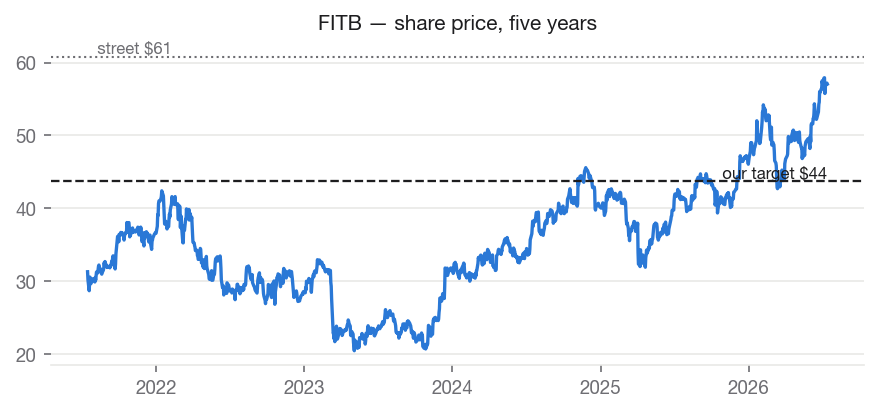
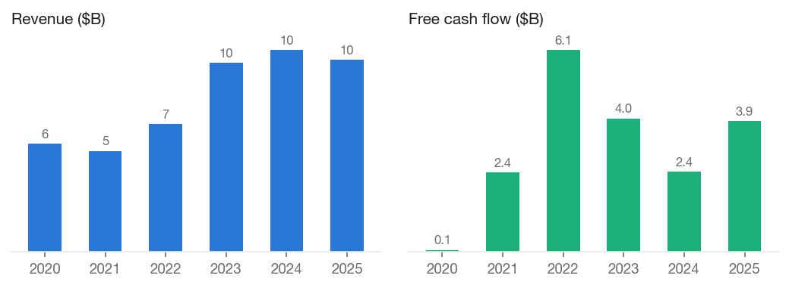
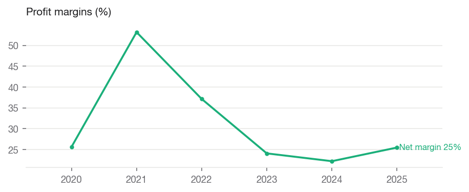
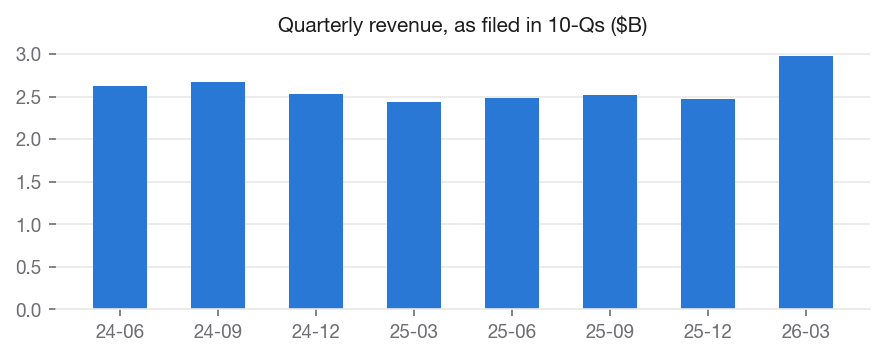
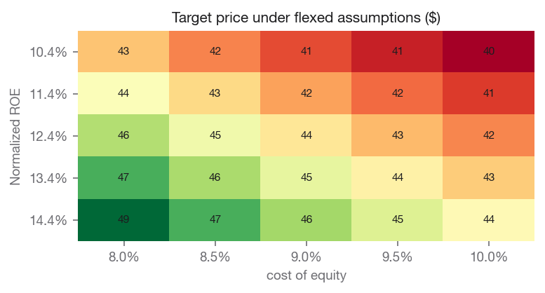

# Fifth Third Bancorp (FITB) — SELL

**Equity Research | Financials — Regional Banks | 2026-07-14**

| | |
|---|---|
| Rating (absolute) | **SELL** |
| Rating (relative, within coverage) | **Underweight** (#4 of coverage) |
| Price | $57.05 |
| Target price | **$43.75** (base model $43.75) |
| Implied upside | -23.3% |
| Street consensus target | $60.80 (20 analysts) |
| Market cap | $51.7B |
| 52-week range | $40.05 – $58.52 |
| Beta | 0.922 |
| Dividend yield | 2.80% |
| Institutional ownership | 91.4% |

## Investment Summary

We rate FITB **SELL** with a price target of **$43.75**, against a current price of $57.05 (-23.3% implied return). Within our coverage universe, the name ranks **Underweight**.

The target blends independent valuation lenses: justified price-to-book values the shares at $36.52; peer comparables values the shares at $47.06; own historical multiple values the shares at $47.65.

Our target sits -28.1% vs. street consensus of $60.80. The divergence is our documented view, not an input: consensus never enters the models.

## Macro & Industry Overview

**Economic backdrop (FRED, latest readings):**

| Indicator | Latest | As of | 1y ago | Change |
|---|---|---|---|---|
| Effective Federal Funds Rate (%) | 3.63 | 2026-06-01 | 4.33 | -0.70 |
| 10-Year Treasury Yield (%) | 4.62 | 2026-07-13 | 4.43 | +0.19 |
| 10Y-2Y Treasury Spread (%) | 0.40 | 2026-07-14 | 0.53 | -0.13 |
| Consumer Price Index (level) | 332.57 | 2026-06-01 | 321.44 | +11.13 |
| Unemployment Rate (%) | 4.20 | 2026-06-01 | 4.10 | +0.10 |
| U. Michigan Consumer Sentiment | 44.80 | 2026-05-01 | 52.20 | -7.40 |
| Personal Consumption Expenditures ($B) | 22,059.80 | 2026-05-01 | 20,755.00 | +1,304.80 |

Cost of equity: **9.03%** (10Y Treasury 4.62% risk-free base, CAPM).

**Macro linkages applied to this valuation** (rule-based, capped; see MACRO_CATALOG.md):

- **credit_spread_erp** [BAA10Y] — Baa spread 1.56%, -0.41pp vs 10y median. Adjustment: -0.20% to cost_of_equity. Credit spreads are a market-priced risk gauge; wider-than-normal spreads raise the equity risk premium.
- **curve_slope_roe** [T10Y2Y] — 10y-2y slope 0.40%, -0.01pp vs 10y median. Adjustment: -0.00% to roe. Banks earn the spread between long lending and short funding; a steeper-than-normal curve supports richer margins and ROE, a flat/inverted curve compresses them.

## Business Description

Fifth Third Bancorp operates as the bank holding company for Fifth Third Bank, National Association that provides a range of financial products and services in the United States. It operates through three segments: Commercial Banking, Consumer and Small Business Banking, and Wealth and Asset Management. The Commercial Banking segment offers credit intermediation, cash management, and financial services; lending and depository products; and cash management, foreign exchange and international trade finance, derivatives and capital markets services, asset-based lending, real estate finance, public finance, commercial leasing, and syndicated finance for business, government, and professional customers. Its Consumer and Small Banking segment engages in the provision of a range of deposit and loan products to individuals and small businesses; residential mortgage activities, including the origination, retention and servicing of residential mortgage loans, sales and securitizations of loans, and associated hedging activities; home equity loans and lines of credit, credit cards, automobile and other indirect lending, and other consumer lending services; and home improvement and solar energy installation loans through contractors and installers. The Wealth and Asset Management segment provides various wealth management services, such as wealth planning, investment management, banking, insurance, trust, and estate services for for individuals, companies, and not-for-profit organizations; retail brokerage services for individual clients; and advisory services for institutional clients. Fifth Third Bancorp was founded in 1858 and is headquartered in Cincinnati, Ohio.

## Financial Analysis

Annual figures from SEC EDGAR as-filed XBRL data (10-K).

| Fiscal year | Revenue | Net margin | Op margin | ROE | Free cash flow |
|---|---|---|---|---|---|
| 2020 | $5.6B | +25.6% | n/a | +6.2% | $0.1B |
| 2021 | $5.2B | +53.2% | n/a | +12.5% | $2.4B |
| 2022 | $6.6B | +37.1% | n/a | +14.1% | $6.1B |
| 2023 | $9.8B | +24.1% | n/a | +12.3% | $4.0B |
| 2024 | $10.4B | +22.2% | n/a | +11.8% | $2.4B |
| 2025 | $9.9B | +25.5% | n/a | +11.6% | $3.9B |

Revenue CAGR: +14.6% (3y), +12.2% (5y). Net income CAGR (5y): +12.1%. FCF CAGR (5y): +126.4%.

### Recent quarters

| Quarter ended | Revenue | Net income | Diluted EPS |
|---|---|---|---|
| 2024-06-30 | $2.6B | $0.6B | $0.81 |
| 2024-09-30 | $2.7B | $0.6B | $0.78 |
| 2024-12-31\* | $2.5B | $0.6B | — |
| 2025-03-31 | $2.4B | $0.5B | $0.71 |
| 2025-06-30 | $2.5B | $0.6B | $0.88 |
| 2025-09-30 | $2.5B | $0.6B | $0.91 |
| 2025-12-31\* | $2.5B | $0.7B | — |
| 2026-03-31 | $3.0B | $0.2B | $0.15 |

\* Fiscal fourth quarters have no 10-Q of their own; they are derived as the annual filing less the three reported quarters. Quarterly EPS is not derived.

## Valuation

We value the company using several independent methods, each of which can be wrong for different reasons. Close agreement across methods increases our confidence in the blended target. A wide spread indicates the value is genuinely uncertain, and we hold the target with lower conviction accordingly. The target averages the three lenses equally.

### Justified price-to-book — $36.52 per share

| Assumption | Value |
|---|---|
| Book per share | 23.97 |
| Normalized roe | 12.44% |
| Cost of equity | 9.03% |
| Growth | 2.50% |
| Fair pb multiple | 1.52 |

### Peer comparables — $47.06 per share

| Assumption | Value |
|---|---|
| Trailing | eps 2.97; peer median pe 13.73 |
| Forward | eps 4.92; peer median pe 10.84 |
| Peers used | HBAN, RF, KEY, CFG, TFC |

### Own historical multiple — $47.65 per share

| Assumption | Value |
|---|---|
| Own avg pe 5y | 9.69 |
| Eps used | 4.92 |
| Eps basis | forward |

**Sensitivity — target price across Normalized ROE (rows) and cost of equity (columns):**

| Normalized ROE | 8.0% | 8.5% | 9.0% | 9.5% | 10.0% |
|---|---|---|---|---|---|
| 10.4% | 43 | 42 | 41 | 41 | 40 |
| 11.4% | 45 | 43 | 43 | 42 | 41 |
| 12.4% | 46 | 45 | 44 | 43 | 42 |
| 13.4% | 47 | 46 | 45 | 44 | 43 |
| 14.4% | 49 | 47 | 46 | 45 | 44 |

### Comparable companies

| Company | Mkt cap | P/E (ttm) | P/E (fwd) | EV/EBITDA | P/B | Net margin | ROE |
|---|---|---|---|---|---|---|---|
| **FITB (subject)** | $51.7B | 19.2 | 11.6 | — | 1.6 | — | — |
| Huntington Bancshares Incorpora | $36.2B | 13.7 | 9.4 | — | 1.2 | 26.6% | 8.4% |
| Regions Financial Corporation | $26.4B | 12.8 | 10.8 | — | 1.5 | 31.0% | 11.9% |
| KeyCorp | $25.1B | 14.3 | 10.8 | — | 1.4 | 27.0% | 10.0% |
| Citizens Financial Group, Inc. | $29.7B | 16.7 | 10.9 | — | 1.2 | 25.0% | 7.7% |
| Truist Financial Corporation | $64.7B | 12.9 | 10.2 | — | 1.1 | 29.6% | 8.6% |

Medians of this table drive the peer-comps lens and the DCF exit multiple. Peer selection is disclosed in universe.py and versioned.

## Investment Risks

- Credit cycle: rising delinquencies and charge-offs flow directly into provisions and earnings; a flat or inverted yield curve compresses net interest margin.
- Against-consensus risk: our rating is below street consensus; if the narrative premium we decline to pay for is validated by delivered earnings, the stock can continue to outperform our target.

## ESG & Governance

Free primary ESG data is limited; this section reports only what can be grounded in market and filing data, and flags sector-specific exposures qualitatively.

- Institutional ownership: 91% — professional holders with governance voting power.
- Public float: 100% of shares outstanding.
- Dividend record: cash returned to shareholders in each of the last 11 fiscal years on file — a capital-discipline signal.
- Governance exposure: regulatory capital and risk oversight are the material governance themes for banks.

## Disclosures

- Generated by Equity-Lens on 2026-07-14 from primary sources: SEC EDGAR (as-filed XBRL financials), Yahoo Finance (market data), FRED (macro series).
- All model values are computed deterministically; methodology is versioned in this repository. Analyst overlays are dated and disclosed in the Investment Summary.
- Street consensus figures are shown for benchmarking only and are never model inputs.
- Educational research project. Not investment advice.
