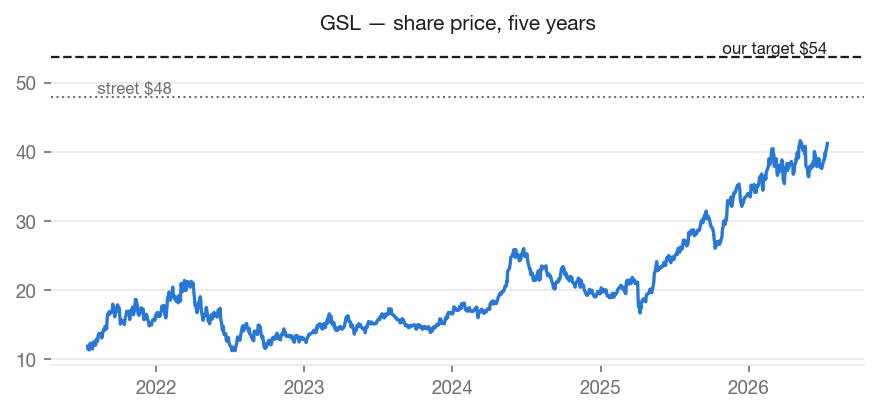
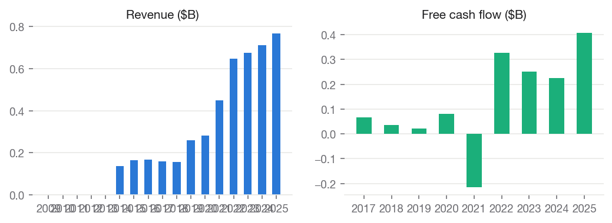
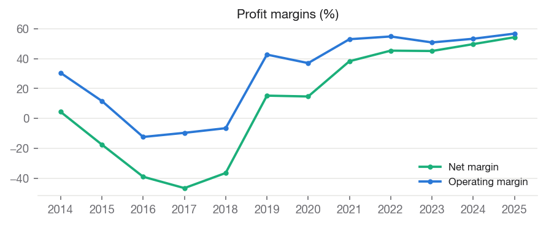
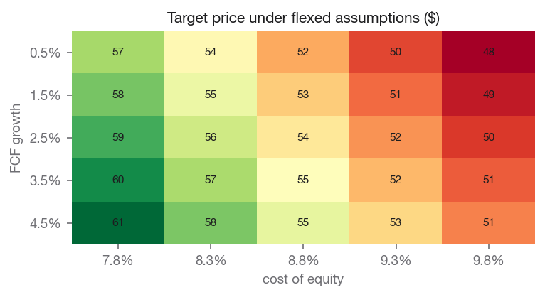

# Global Ship Lease, Inc. (GSL) — BUY

**Equity Research | Industrials — Marine Shipping (Containership Lessor) | 2026-07-14**

| | |
|---|---|
| Rating (absolute) | **BUY** |
| Rating (relative, within coverage) | **Top Pick** (#1 of coverage) |
| Price | $41.24 |
| Target price | **$53.78** (base model $53.78) |
| Implied upside | +30.4% |
| Street consensus target | $48.00 (3 analysts) |
| Market cap | $1.5B |
| 52-week range | $27.20 – $42.70 |
| Beta | 0.876 |
| Dividend yield | 6.13% |
| Institutional ownership | 48.9% |

## Investment Summary

We rate GSL **BUY** with a price target of **$53.78**, against a current price of $41.24 (+30.4% implied return). Within our coverage universe, the name ranks **Top Pick**.

The target blends independent valuation lenses: discounted cash flow values the shares at $83.51; peer comparables values the shares at $49.13; own historical multiple values the shares at $18.79.

Our target sits +12.0% vs. street consensus of $48.00. The divergence is our documented view, not an input: consensus never enters the models.

## The Investment Thesis

**Initiating at BUY, $54 target: the charter book pays for the wait; the cycle is the risk.**

- **Valuation:** our three lenses value GSL at $84 (DCF on the
  maintenance-capex basis), $49 (peer multiples), and $19 (own
  historical multiple), blending to a $54 target against a $41 price
  (+30%). Street consensus is $48 across a thin three-analyst coverage
  base. The stock trades near 4x trailing earnings with a 6.1%
  dividend yield.
- **Read the spread honestly:** a $19–$84 range across independent
  methods is the widest in our coverage and is itself the finding —
  containership leasing is a cyclical business whose value depends
  heavily on where charter rates settle. Per our stated methodology, a
  wide spread means lower conviction, and we size the rating
  accordingly: this is a BUY supported by contracted cash flows, not a
  table-pounder.
- **Why we lean positive anyway:** as of March 31, 2026 GSL had $2.05
  billion of contracted future revenue — roughly 1.4x its entire $1.5B
  market capitalization — with 100% of 2026 fleet days and 86% of 2027
  already chartered at fixed rates. The near-term cash flows funding
  the dividend and deleveraging are largely locked regardless of spot
  market conditions.
- **What we are not paying for:** the own-history lens at $19 records
  that this stock has spent years at 2–3x earnings when the cycle
  turned. We believe the contract cover justifies a higher floor than
  history's, but we treat the $84 DCF as an upper bound, not a base
  case, and we anchor on the comps.

## Macro & Industry Overview

**Economic backdrop (FRED, latest readings):**

| Indicator | Latest | As of | 1y ago | Change |
|---|---|---|---|---|
| Effective Federal Funds Rate (%) | 3.63 | 2026-06-01 | 4.33 | -0.70 |
| 10-Year Treasury Yield (%) | 4.62 | 2026-07-13 | 4.43 | +0.19 |
| 10Y-2Y Treasury Spread (%) | 0.40 | 2026-07-14 | 0.53 | -0.13 |
| Consumer Price Index (level) | 332.57 | 2026-06-01 | 321.44 | +11.13 |
| Unemployment Rate (%) | 4.20 | 2026-06-01 | 4.10 | +0.10 |
| U. Michigan Consumer Sentiment | 44.80 | 2026-05-01 | 52.20 | -7.40 |
| Personal Consumption Expenditures ($B) | 22,059.80 | 2026-05-01 | 20,755.00 | +1,304.80 |

Cost of equity: **8.79%** (10Y Treasury 4.62% risk-free base, CAPM).

**Macro linkages applied to this valuation** (rule-based, capped; see MACRO_CATALOG.md):

- **credit_spread_erp** [BAA10Y] — Baa spread 1.56%, -0.41pp vs 10y median. Adjustment: -0.20% to cost_of_equity. Credit spreads are a market-priced risk gauge; wider-than-normal spreads raise the equity risk premium.

## Business Description

Global Ship Lease, Inc., together with its subsidiaries, engages in owning and chartering out containerships under fixed-rate charters to container liner companies worldwide. As of March 12, 2026, it owned 71 mid-sized and smaller containerships, ranging from 2,207 to 11,040 (TEU), with an aggregate capacity of 423,003 TEU. Global Ship Lease, Inc. was founded in 2007 and is based in Athens, Greece.

### Segments and revenue drivers

GSL operates a single business: owning containerships and chartering
them to liner operators at fixed rates for multi-year terms.

- **Fleet:** 71 containerships as of March 31, 2026, concentrated in
  mid-sized and smaller vessel classes — the segment with the thinnest
  newbuild orderbook and, in management's view and ours, the most
  favorable long-term supply picture.
- **Charter book:** $2.05B of contracted revenue at an average
  remaining duration of 2.6 years; 100% charter coverage for 2026 and
  86% for 2027. Q1 2026 revenue was $198.1M.
- **Revenue model:** customers are the liner companies (the operators
  who actually move containers); GSL takes multi-year fixed-rate
  charters rather than spot exposure, which converts a violently
  cyclical rate environment into a bond-like near-term cash stream —
  and defers, rather than eliminates, cyclical risk to re-chartering
  dates.
- **Capital returns:** an annualized dividend of $2.50 per share
  (~6.1% at the current price), plus 8.75% Series B preferred
  distributions; management has also repurchased shares
  opportunistically in past dislocations.

## Industry Overview and Competitive Positioning

- **The cycle, currently favorable:** containership charter markets in
  2026 remain tight. Red Sea diversions and the effective closure of
  the Strait of Hormuz continue to absorb effective fleet capacity by
  lengthening voyages, supporting both rates and the value of charter
  flexibility, as management noted with Q1 results. Tight markets let
  lessors re-charter expiring vessels at strong rates and extend
  duration.
- **The supply side:** the industry's newbuild orderbook is
  concentrated in the largest vessel classes; the mid-size and smaller
  segments where GSL's fleet lives have seen comparatively little
  ordering, an aging global fleet, and tightening environmental
  regulation that encourages scrapping — a constructive multi-year
  supply setup for GSL's niche.
- **The structural caveat:** every containership cycle in history has
  ended, usually when disruption normalizes into overcapacity. A
  reopening of normal routings, a demand recession, or delivery of the
  large-vessel orderbook cascading charter capacity downward would
  pressure rates. GSL's contract cover buys 1–2 years of insulation;
  it does not repeal the cycle.
- **Where GSL sits:** as a lessor with fixed-rate charters, GSL is one
  step removed from spot volatility — its results lag the cycle in
  both directions. The stock, however, trades with the cycle, which is
  why the equity has historically been valued at low single-digit
  earnings multiples.

### The moat — durability of the franchise

We are explicit about what GSL is not: this is not a moated franchise.
Containerships are commodity assets; charter rates are set by a global
market; customers are consolidated liners with negotiating leverage.
The durable edges, such as they are:

- **The contract book itself:** $2.05B of fixed-rate backlog is the
  closest thing to a moat a lessor can hold — near-term cash flows are
  contractual, not competitive.
- **Fleet positioning:** concentration in supply-constrained mid-size
  classes with high reefer capacity, which earn scarcity premiums at
  re-chartering when markets are tight.
- **Counter-cyclical acquisition record:** management has historically
  bought vessels in downturns at low prices and chartered them into
  recoveries — a repeatable discipline, though one that depends on
  management rather than structure.

We assess the franchise as execution-dependent rather than
structurally protected, and we weight the valuation accordingly (the
comps lens, not the DCF, anchors our target).

## Financial Analysis

Annual figures from SEC EDGAR as-filed XBRL data (10-K).

| Fiscal year | Revenue | Net margin | Op margin | ROE | Free cash flow |
|---|---|---|---|---|---|
| 2020 | $0.3B | +14.7% | +37.0% | +8.9% | $0.1B |
| 2021 | $0.4B | +38.3% | +53.0% | +24.1% | $-0.2B |
| 2022 | $0.6B | +45.4% | +54.9% | +30.3% | $0.3B |
| 2023 | $0.7B | +45.1% | +50.9% | +25.7% | $0.3B |
| 2024 | $0.7B | +49.7% | +53.3% | +24.2% | $0.2B |
| 2025 | $0.8B | +54.3% | +56.8% | +23.1% | $0.4B |

Revenue CAGR: +5.9% (3y), +22.1% (5y). Net income CAGR (5y): +58.6%. FCF CAGR (5y): +38.0%.

## Management and Capital Allocation

- **Leadership:** Executive Chairman George Youroukos (founder of
  Technomar Shipping, GSL's largest shareholder group) and CEO Thomas
  Lister, who has led commercial and financial strategy at GSL for
  over a decade. Alignment through the chairman's economic stake is
  substantial by design.
- **Capital allocation record:** the past five years show a clear
  sequence — deleverage first (net debt reduced materially from
  post-2021 peaks), then return capital (the dividend has been raised
  repeatedly, to $2.50 annualized for 2026), with opportunistic
  buybacks in dislocations and disciplined, counter-cyclical fleet
  purchases. For a cyclical lessor we regard this as the correct
  priority order.
- **Watch item:** related-party dynamics inherent in the
  Technomar/GSL relationship (ship management services) are standard
  for the sector but warrant ongoing disclosure review.
- **Methodology note:** our DCF uses the maintenance-capex basis
  declared for fleet buyers (see DECISIONS.md): vessel acquisitions
  are growth investment, not upkeep, and charging them wholly against
  a single year's cash flow would misvalue the company. Depreciation
  proxies fleet upkeep; the bias this introduces is disclosed and
  argues for anchoring on comps.

## Valuation

We value the company using several independent methods, each of which can be wrong for different reasons. Close agreement across methods increases our confidence in the blended target. A wide spread indicates the value is genuinely uncertain, and we hold the target with lower conviction accordingly. Weights: discounted cash flow 40%, peer comparables 30%, own historical multiple 30%.

### Discounted cash flow — $83.51 per share

| Assumption | Value |
|---|---|
| Fcf base | $0.3B |
| Initial growth | 2.50% |
| Terminal growth | 2.50% |
| Cost of equity | 8.79% |
| Exit multiple | 3.58 |
| Projection years | 5.00 |
| Net debt | $0.3B |
| Fcf basis | operating cash flow less depreciation (maintenance basis, declared by the sector playbook; growth capital expenditure excluded) |
| Capex to depreciation | 1.34x |

### Peer comparables — $49.13 per share

| Assumption | Value |
|---|---|
| Trailing | eps 10.57; peer median pe 4.99 |
| Forward | eps 8.99; peer median pe 5.07 |
| Peers used | DAC, CMRE, ESEA, NMM |

### Own historical multiple — $18.79 per share

| Assumption | Value |
|---|---|
| Own avg pe 5y | 2.09 |
| Eps used | 8.99 |
| Eps basis | forward |

**Sensitivity — target price across FCF growth (rows) and cost of equity (columns):**

| FCF growth | 7.8% | 8.3% | 8.8% | 9.3% | 9.8% |
|---|---|---|---|---|---|
| 0.5% | 57 | 54 | 52 | 50 | 48 |
| 1.5% | 58 | 55 | 53 | 51 | 49 |
| 2.5% | 59 | 56 | 54 | 52 | 50 |
| 3.5% | 60 | 57 | 55 | 52 | 51 |
| 4.5% | 61 | 58 | 55 | 53 | 51 |

### DCF walk — the projection, year by year

The base free cash flow of $0.3B is measured as operating cash flow less depreciation (maintenance basis, declared by the sector playbook; growth capital expenditure excluded). Growth fades from 2.5% toward 2.5%, and each year is discounted at 8.79%.

| Year | Growth | Free cash flow | Discount factor | Present value |
|---|---|---|---|---|
| 1 | +2.5% | $0.3B | 0.919 | $0.3B |
| 2 | +2.5% | $0.3B | 0.845 | $0.3B |
| 3 | +2.5% | $0.3B | 0.777 | $0.2B |
| 4 | +2.5% | $0.3B | 0.714 | $0.2B |
| 5 | +2.5% | $0.3B | 0.656 | $0.2B |

- Sum of explicit-period value: $1.2B
- Terminal value: average of Gordon growth ($5.2B) and exit multiple ($1.1B), discounted to $2.1B (64% of total value)
- Less net debt $0.3B → equity value $3.0B → **$83.51 per share**

### Comparable companies

| Company | Mkt cap | P/E (ttm) | P/E (fwd) | EV/EBITDA | P/B | Net margin | ROE |
|---|---|---|---|---|---|---|---|
| **GSL (subject)** | $1.5B | 3.9 | 4.6 | — | 0.8 | — | — |
| Danaos Corporation | $2.4B | 4.6 | 5.3 | 3.5 | 0.6 | 49.9% | 14.0% |
| Costamare Inc. | $1.8B | 5.4 | 5.5 | 5.0 | 0.9 | 39.8% | 15.0% |
| Euroseas Ltd. | $0.5B | 3.7 | 4.8 | 3.3 | 1.0 | 58.3% | 30.5% |
| Navios Maritime Partners LP | $2.1B | 6.3 | 4.4 | 5.4 | 0.6 | 25.0% | 10.7% |

Medians of this table drive the peer-comps lens and the DCF exit multiple. Peer selection is disclosed in universe.py and versioned.

## Catalysts and What Would Change Our Mind

Key events and what they would do to our view:

1. **Q2 2026 results (expected August):** we watch re-chartering
   fixtures — rates and durations achieved on expiring charters — and
   any additions to the $2.05B backlog. Continued forward cover at
   strong rates extends the earnings floor into 2028.
2. **2027 coverage progression:** coverage stood at 86% for 2027 at
   the Q1 print. Movement toward full cover de-risks the year; stalling
   suggests softening charterer appetite and would begin to validate
   the bear case.
3. **Trade-route normalization:** resolution of Red Sea/Hormuz
   disruptions would release effective capacity back into the market
   and pressure rates — the principal macro risk to the thesis, and
   one whose timing is unforecastable.
4. **Capital returns:** dividend increases or resumed buybacks at
   sub-book valuations would each add support; the current 6.1% yield
   is covered multiple times by contracted cash flow.
5. **Rating triggers:** we would revisit the BUY on (a) price
   convergence toward $54, (b) forward charter coverage for the next
   full year falling below ~85%, or (c) evidence of rate rollover in
   re-chartering fixtures — any of which would signal the cycle
   turning before the contract book can insulate results.

## Investment Risks

- Valuation model risk: 64% of DCF value sits in the terminal period — the estimate is sensitive to terminal assumptions, as the sensitivity grid shows.

## ESG & Governance

Free primary ESG data is limited; this section reports only what can be grounded in market and filing data, and flags sector-specific exposures qualitatively.

- Institutional ownership: 49% — professional holders with governance voting power.
- Public float: 85% of shares outstanding.
- Dividend record: cash returned to shareholders in each of the last 7 fiscal years on file — a capital-discipline signal.

## Disclosures

- Generated by Equity-Lens on 2026-07-14 from primary sources: SEC EDGAR (as-filed XBRL financials), Yahoo Finance (market data), FRED (macro series).
- All model values are computed deterministically; methodology is versioned in this repository. Analyst overlays are dated and disclosed in the Investment Summary.
- Street consensus figures are shown for benchmarking only and are never model inputs.
- Educational research project. Not investment advice.
