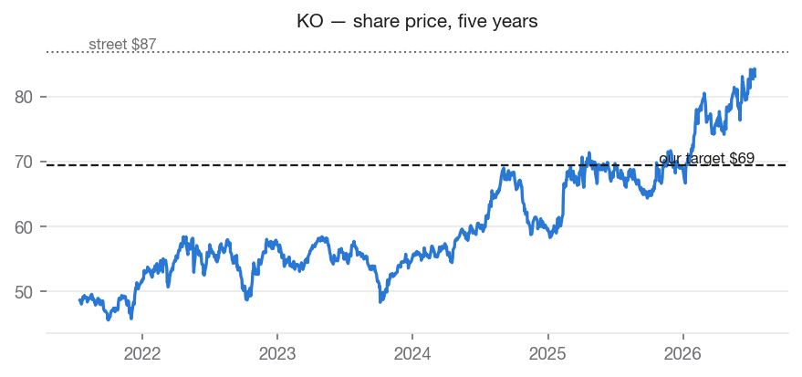
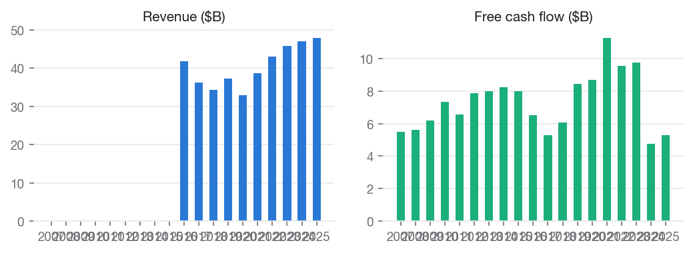
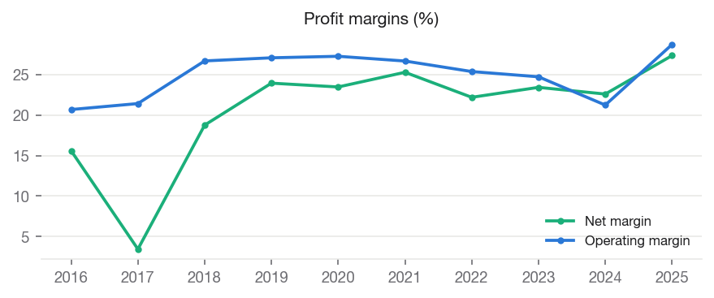
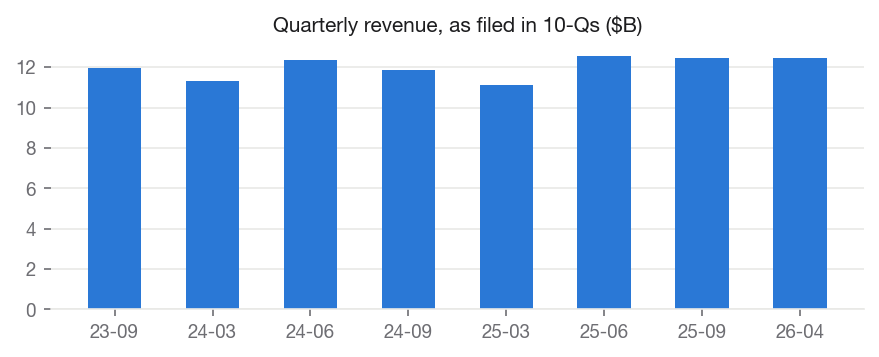
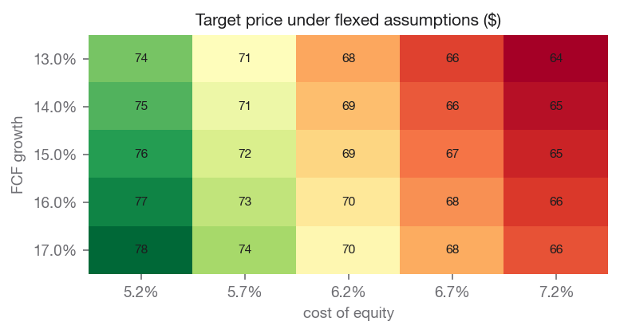

# The Coca-Cola Company (KO) — SELL

**Equity Research | Consumer Staples — Beverages | 2026-07-14**

| | |
|---|---|
| Rating (absolute) | **SELL** |
| Rating (relative, within coverage) | **Neutral** (#3 of coverage) |
| Price | $83.08 |
| Target price | **$69.38** (base model $69.38) |
| Implied upside | -16.5% |
| Street consensus target | $86.85 (24 analysts) |
| Market cap | $357.5B |
| 52-week range | $65.35 – $85.68 |
| Beta | 0.349 |
| Dividend yield | 2.52% |
| Institutional ownership | 68.3% |

## Investment Summary

We rate KO **SELL** with a price target of **$69.38**, against a current price of $83.08 (-16.5% implied return). Within our coverage universe, the name ranks **Neutral**.

The target blends independent valuation lenses: discounted cash flow values the shares at $66.19; peer comparables values the shares at $65.95; own historical multiple values the shares at $77.07.

Our target sits -20.1% vs. street consensus of $86.85. The divergence is our documented view, not an input: consensus never enters the models.

## Macro & Industry Overview

**Economic backdrop (FRED, latest readings):**

| Indicator | Latest | As of | 1y ago | Change |
|---|---|---|---|---|
| Effective Federal Funds Rate (%) | 3.63 | 2026-06-01 | 4.33 | -0.70 |
| 10-Year Treasury Yield (%) | 4.62 | 2026-07-13 | 4.43 | +0.19 |
| 10Y-2Y Treasury Spread (%) | 0.40 | 2026-07-14 | 0.53 | -0.13 |
| Consumer Price Index (level) | 332.57 | 2026-06-01 | 321.44 | +11.13 |
| Unemployment Rate (%) | 4.20 | 2026-06-01 | 4.10 | +0.10 |
| U. Michigan Consumer Sentiment | 44.80 | 2026-05-01 | 52.20 | -7.40 |
| Personal Consumption Expenditures ($B) | 22,059.80 | 2026-05-01 | 20,755.00 | +1,304.80 |

Cost of equity: **6.16%** (10Y Treasury 4.62% risk-free base, CAPM).

**Macro linkages applied to this valuation** (rule-based, capped; see MACRO_CATALOG.md):

- **credit_spread_erp** [BAA10Y] — Baa spread 1.56%, -0.41pp vs 10y median. Adjustment: -0.20% to cost_of_equity. Credit spreads are a market-priced risk gauge; wider-than-normal spreads raise the equity risk premium.
- **dollar_translation** [DTWEXBGS] — Trade-weighted dollar +0.6% y/y. Adjustment: -0.11% to growth. ~64% of revenue is foreign; a stronger dollar shrinks it in translation, a weaker one inflates it.
- **commodity_margin** [PALUMUSDM/PSUGAISAUSDM] — Aluminum & sugar avg +10.9% y/y. Adjustment: -1.50% to growth. Cans and sweetener are real input costs for a beverage maker; cost inflation pressures margins unless fully passed through in price.

## Business Description

The Coca-Cola Company, a beverage company, manufactures and sells various nonalcoholic beverages in the United States and internationally. The company provides Trademark Coca-Cola, sparkling soft drinks and flavors; water, sports, coffee, and tea; juice, value-added dairy, and plant-based beverages; and emerging beverages. It also offers beverage concentrates and syrups, as well as fountain syrups to fountain retailers comprising restaurants and convenience stores. The company sells its products under the Coca-Cola, Diet Coke/Coca-Cola Light, Coca-Cola Zero Sugar, caffeine free Diet Coke, Cherry Coke, Fanta, Sprite, Simply, Fanta Orange, Fanta Zero Orange, Fanta Zero Sugar, Fanta Apple, Sprite Zero Sugar, Simply Orange, Simply Apple, Simply Grapefruit, Fresca, Schweppes, Thums Up, Aquarius, Ayataka, BODYARMOR, Ciel, Costa, Crystal, Dasani, Fuze Tea, Georgia, glacéau smartwater, glacéau vitaminwater, Gold Peak, I LOHAS, Powerade, Topo Chico, Core Power, Del Valle, fairlife, innocent, Maaza, Minute Maid, Minute Maid Pulpy, Santa Clara, and dogadan brands. It operates through a network of independent bottling partners, distributors, wholesalers, and retailers, as well as through bottling and distribution operators. The Coca-Cola Company was founded in 1886 and is headquartered in Atlanta, Georgia.

## Financial Analysis

Annual figures from SEC EDGAR as-filed XBRL data (10-K).

| Fiscal year | Revenue | Net margin | Op margin | ROE | Free cash flow |
|---|---|---|---|---|---|
| 2020 | $33.0B | +23.5% | +27.3% | +36.4% | $8.7B |
| 2021 | $38.7B | +25.3% | +26.7% | +39.3% | $11.3B |
| 2022 | $43.0B | +22.2% | +25.4% | +36.9% | $9.5B |
| 2023 | $45.8B | +23.4% | +24.7% | +39.0% | $9.7B |
| 2024 | $47.1B | +22.6% | +21.2% | +40.3% | $4.7B |
| 2025 | $47.9B | +27.3% | +28.7% | +38.2% | $5.3B |

Revenue CAGR: +3.7% (3y), +7.7% (5y). Net income CAGR (5y): +11.1%. FCF CAGR (5y): -9.4%.

### Recent quarters

| Quarter ended | Revenue | Net income | Diluted EPS |
|---|---|---|---|
| 2024-06-28 | $12.4B | $2.4B | $0.56 |
| 2024-09-27 | $11.9B | $2.8B | $0.66 |
| 2024-12-31\* | $11.5B | $2.2B | — |
| 2025-03-28 | $11.1B | $3.3B | $0.77 |
| 2025-06-27 | $12.5B | $3.8B | $0.88 |
| 2025-09-26 | $12.5B | $3.7B | $0.86 |
| 2025-12-31\* | $11.8B | $2.3B | — |
| 2026-04-03 | $12.5B | $3.9B | $0.91 |

\* Fiscal fourth quarters have no 10-Q of their own; they are derived as the annual filing less the three reported quarters. Quarterly EPS is not derived.

## Valuation

We value the company using several independent methods, each of which can be wrong for different reasons. Close agreement across methods increases our confidence in the blended target. A wide spread indicates the value is genuinely uncertain, and we hold the target with lower conviction accordingly. Weights: discounted cash flow 40%, peer comparables 30%, own historical multiple 30%.

### Discounted cash flow — $66.19 per share

| Assumption | Value |
|---|---|
| Fcf base | $9.5B |
| Initial growth | 15.00% |
| Terminal growth | 2.50% |
| Cost of equity | 6.16% |
| Exit multiple | 19.78 |
| Projection years | 5.00 |
| Net debt | $25.3B |
| Fcf basis | operating cash flow less all capital expenditure (standard basis) |
| Capex to depreciation | 1.64x |

### Peer comparables — $65.95 per share

| Assumption | Value |
|---|---|
| Trailing | eps 3.18; peer median pe 22.41 |
| Forward | eps 3.48; peer median pe 17.42 |
| Peers used | PEP, KDP, MNST, MDLZ, PG |

### Own historical multiple — $77.07 per share

| Assumption | Value |
|---|---|
| Own avg pe 5y | 22.14 |
| Eps used | 3.48 |
| Eps basis | forward |

**Sensitivity — target price across FCF growth (rows) and cost of equity (columns):**

| FCF growth | 5.2% | 5.7% | 6.2% | 6.7% | 7.2% |
|---|---|---|---|---|---|
| 13.0% | 75 | 71 | 68 | 66 | 64 |
| 14.0% | 75 | 72 | 69 | 67 | 65 |
| 15.0% | 76 | 72 | 69 | 67 | 65 |
| 16.0% | 77 | 73 | 70 | 68 | 66 |
| 17.0% | 78 | 74 | 71 | 68 | 66 |

### DCF walk — the projection, year by year

The base free cash flow of $9.5B is measured as operating cash flow less all capital expenditure (standard basis). Growth fades from 15.0% toward 2.5%, and each year is discounted at 6.16%.

| Year | Growth | Free cash flow | Discount factor | Present value |
|---|---|---|---|---|
| 1 | +15.0% | $11.0B | 0.942 | $10.3B |
| 2 | +11.9% | $12.3B | 0.887 | $10.9B |
| 3 | +8.8% | $13.3B | 0.836 | $11.1B |
| 4 | +5.6% | $14.1B | 0.787 | $11.1B |
| 5 | +2.5% | $14.4B | 0.742 | $10.7B |

- Sum of explicit-period value: $54.2B
- Terminal value: average of Gordon growth ($404.5B) and exit multiple ($285.7B), discounted to $255.9B (83% of total value)
- Less net debt $25.3B → equity value $284.8B → **$66.19 per share**

### Comparable companies

| Company | Mkt cap | P/E (ttm) | P/E (fwd) | EV/EBITDA | P/B | Net margin | ROE |
|---|---|---|---|---|---|---|---|
| **KO (subject)** | $357.5B | 26.1 | 23.9 | — | 10.6 | — | — |
| Pepsico, Inc. | $185.0B | 17.8 | 15.1 | 12.3 | 8.7 | 10.8% | 51.5% |
| Keurig Dr Pepper Inc. | $41.2B | 22.4 | 12.0 | 17.8 | 1.6 | 10.8% | 6.3% |
| Monster Beverage Corporation | $95.8B | 47.3 | 37.9 | 32.9 | 11.0 | 23.1% | 26.7% |
| Mondelez International, Inc. | $75.5B | 29.1 | 17.4 | 18.3 | 2.9 | 6.6% | 10.2% |
| Procter & Gamble Company (The) | $340.2B | 21.4 | 20.7 | 14.8 | 6.3 | 19.2% | 31.1% |

Medians of this table drive the peer-comps lens and the DCF exit multiple. Peer selection is disclosed in universe.py and versioned.

## Investment Risks

- Input-cost inflation (aluminum, sweetener) pressures gross margin if not passed through in price.
- Currency: ~64% of revenue is earned abroad; a strengthening dollar is a mechanical translation headwind.
- Valuation model risk: 83% of DCF value sits in the terminal period — the estimate is sensitive to terminal assumptions, as the sensitivity grid shows.
- Against-consensus risk: our rating is below street consensus; if the narrative premium we decline to pay for is validated by delivered earnings, the stock can continue to outperform our target.

## ESG & Governance

Free primary ESG data is limited; this section reports only what can be grounded in market and filing data, and flags sector-specific exposures qualitatively.

- Institutional ownership: 68% — professional holders with governance voting power.
- Public float: 90% of shares outstanding.
- Dividend record: cash returned to shareholders in each of the last 19 fiscal years on file — a capital-discipline signal.
- Environmental exposure: packaging (aluminum, plastic) and water sourcing are the material environmental themes for beverage producers.

## Disclosures

- Generated by Equity-Lens on 2026-07-14 from primary sources: SEC EDGAR (as-filed XBRL financials), Yahoo Finance (market data), FRED (macro series).
- All model values are computed deterministically; methodology is versioned in this repository. Analyst overlays are dated and disclosed in the Investment Summary.
- Street consensus figures are shown for benchmarking only and are never model inputs.
- Educational research project. Not investment advice.
