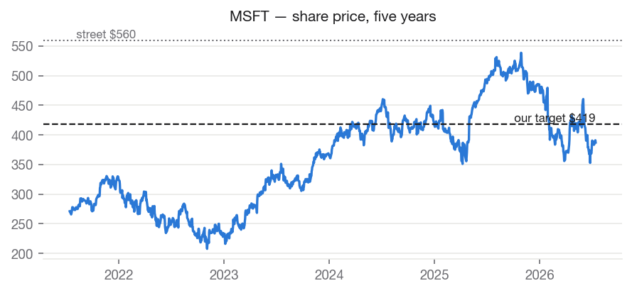
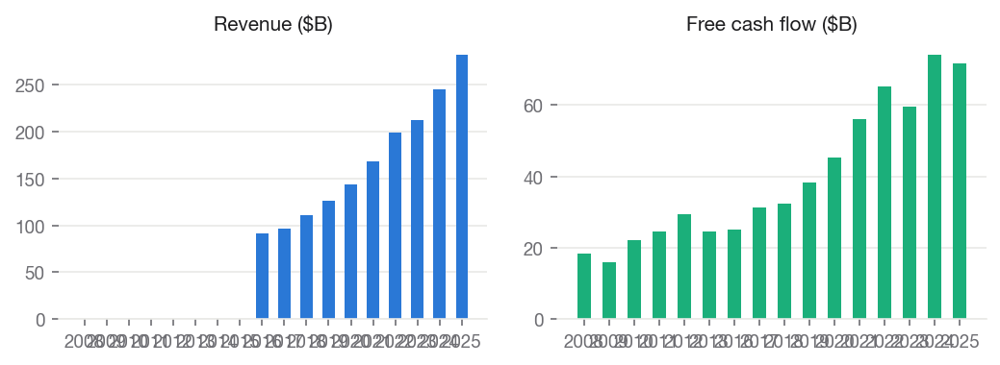
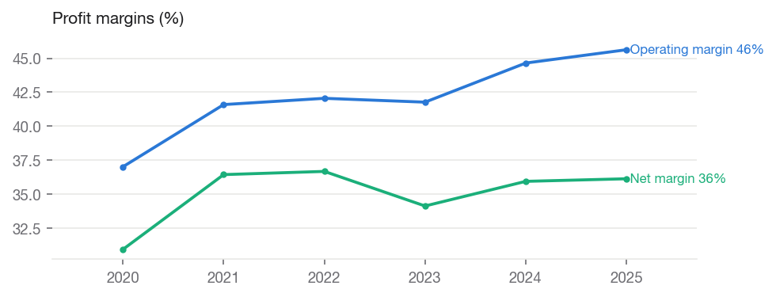
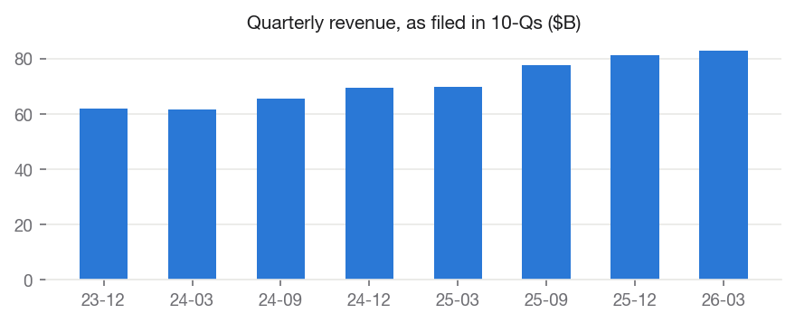
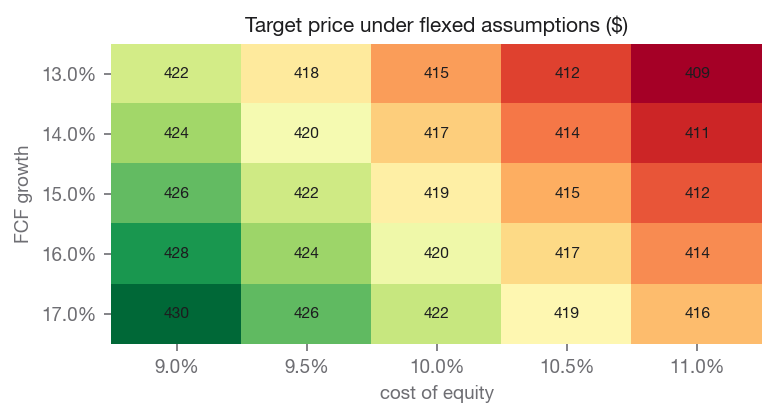

# Microsoft Corporation (MSFT) — HOLD

**Equity Research | Technology — Software & Cloud | 2026-07-14**

| | |
|---|---|
| Rating (absolute) | **HOLD** |
| Rating (relative, within coverage) | **Overweight** (#2 of coverage) |
| Price | $387.21 |
| Target price | **$418.53** (base model $418.53) |
| Implied upside | +8.1% |
| Street consensus target | $559.86 (55 analysts) |
| Market cap | $2,876.4B |
| 52-week range | $349.20 – $555.45 |
| Beta | 1.13 |
| Dividend yield | 0.95% |
| Institutional ownership | 75.7% |

## Investment Summary

We rate MSFT **HOLD** with a target of **$418.53** vs. a current price of $387.21 (+8.1% implied). Within our coverage universe the name ranks **Overweight**.

The target blends independent valuation lenses: dcf $218.13, comps $467.28, own multiple $636.96.

Our target sits -25.2% vs. street consensus of $559.86. The divergence is our documented view, not an input: consensus never enters the models.

## Macro & Industry Overview

**Economic backdrop (FRED, latest readings):**

| Indicator | Latest | As of | 1y ago | Change |
|---|---|---|---|---|
| Effective Federal Funds Rate (%) | 3.63 | 2026-06-01 | 4.33 | -0.70 |
| 10-Year Treasury Yield (%) | 4.56 | 2026-07-10 | 4.35 | +0.21 |
| 10Y-2Y Treasury Spread (%) | 0.36 | 2026-07-13 | 0.53 | -0.17 |
| Consumer Price Index (level) | 332.57 | 2026-06-01 | 321.44 | +11.13 |
| Unemployment Rate (%) | 4.20 | 2026-06-01 | 4.10 | +0.10 |
| U. Michigan Consumer Sentiment | 44.80 | 2026-05-01 | 52.20 | -7.40 |
| Personal Consumption Expenditures ($B) | 22,059.80 | 2026-05-01 | 20,755.00 | +1,304.80 |

Cost of equity: **10.02%** (10Y Treasury 4.56% risk-free base, CAPM).

**Macro linkages applied to this valuation** (rule-based, capped; see MACRO_CATALOG.md):

- **credit_spread_erp** [BAA10Y] — Baa spread 1.58%, -0.39pp vs 10y median. Adjustment: -0.19% to cost_of_equity. Credit spreads are a market-priced risk gauge; wider-than-normal spreads raise the equity risk premium.
- **dollar_translation** [DTWEXBGS] — Trade-weighted dollar +0.6% y/y. Adjustment: -0.08% to growth. ~49% of revenue is foreign; a stronger dollar shrinks it in translation, a weaker one inflates it.
- **software_investment_demand** [B985RC1Q027SBEA] — Business software investment +9.9% y/y vs +9.5% trend. Adjustment: +0.10% to growth. National-accounts software investment is the demand pool for enterprise IT; spend above/below trend leans on growth.

## Business Description

Microsoft Corporation develops and supports software, services, devices, and solutions worldwide. The Productivity and Business Processes segment offers Microsoft 365 commercial, enterprise mobility + security, windows commercial, power BI, exchange, sharepoint, Microsoft teams, security and compliance, and copilot; Microsoft 365 commercial products, such as Windows commercial on-premises and office licensed services; Microsoft 365 consumer products and cloud services, including Microsoft 365 consumer subscriptions, office licensed on-premises, and other consumer services; LinkedIn; dynamics products and cloud services, such as dynamics 365, cloud-based applications, and on-premises ERP and CRM applications. Its Intelligent Cloud segment provides Server products and cloud services comprising Azure and other cloud services, GitHub, Nuance Healthcare, virtual desktop offerings, and other cloud services; server products, including SQL and windows server, visual studio and system center related client access licenses, and other on-premises offerings; enterprise and partner services, such as enterprise support and nuance professional services, industry solutions, Microsoft partner network, and learning experience. The Personal Computing segment provides windows and devices, such as Windows OEM licensing and devices and surface and PC accessories; gaming services and solutions, such as Xbox hardware, content, and services, first- and third-party content Xbox game pass, subscriptions, and cloud gaming, advertising, and other cloud services; search and news advertising services. It sells its products through OEMs, distributors, and resellers; and online and retail stores. The company has a strategic collaboration with Mayo Clinic, Inc. for the development of a frontier AI model for healthcare; and Global Objects, Inc. to build a retrieval-grounded generative AI world model. The company was founded in 1975 and is headquartered in Redmond, Washington.

## Financial Analysis

Annual figures from SEC EDGAR as-filed XBRL data (10-K).

| Fiscal year | Revenue | Net margin | Op margin | ROE | Free cash flow |
|---|---|---|---|---|---|
| 2020 | $143.0B | +31.0% | +37.0% | +37.4% | $45.2B |
| 2021 | $168.1B | +36.5% | +41.6% | +43.2% | $56.1B |
| 2022 | $198.3B | +36.7% | +42.1% | +43.7% | $65.1B |
| 2023 | $211.9B | +34.1% | +41.8% | +35.1% | $59.5B |
| 2024 | $245.1B | +36.0% | +44.6% | +32.8% | $74.1B |
| 2025 | $281.7B | +36.1% | +45.6% | +29.6% | $71.6B |

Revenue CAGR: +12.4% (3y), +14.5% (5y). Net income CAGR (5y): +18.1%. FCF CAGR (5y): +9.6%.

### Recent quarters (10-Q, as filed)

| Quarter ended | Revenue | Net income | Diluted EPS |
|---|---|---|---|
| 2023-12-31 | $62.0B | $21.9B | $2.93 |
| 2024-03-31 | $61.9B | $21.9B | $2.94 |
| 2024-09-30 | $65.6B | $24.7B | $3.30 |
| 2024-12-31 | $69.6B | $24.1B | $3.23 |
| 2025-03-31 | $70.1B | $25.8B | $3.46 |
| 2025-09-30 | $77.7B | $27.7B | $3.72 |
| 2025-12-31 | $81.3B | $38.5B | $5.16 |
| 2026-03-31 | $82.9B | $31.8B | $4.27 |

## Valuation

**Dcf: $218.13**

- fcf base: $65.1B
- initial growth: 15.00%
- terminal growth: 2.50%
- cost of equity: 10.02%
- exit multiple: 28.74
- projection years: 5.00
- net debt: $9.9B
- fcf basis: ocf minus all capex (standard)
- capex to depreciation: 2.23
- diagnostic flag: capex runs well above depreciation on the standard basis — review whether this sector needs the maintenance-capex playbook

**Comps: $467.28**

- trailing: eps 16.77; peer median pe 27.35
- forward: eps 19.36; peer median pe 24.58
- peers used: AAPL, GOOGL, ORCL, CRM, AMZN

**Own Multiple: $636.96**

- own avg pe 5y: 32.90
- eps used: 19.36
- eps basis: forward

**Sensitivity — target price across FCF growth (rows) and cost of equity (columns):**

| FCF growth | 9.0% | 9.5% | 10.0% | 10.5% | 11.0% |
|---|---|---|---|---|---|
| 13.0% | 422 | 418 | 415 | 412 | 409 |
| 14.0% | 424 | 420 | 417 | 414 | 411 |
| 15.0% | 426 | 422 | 419 | 415 | 412 |
| 16.0% | 428 | 424 | 420 | 417 | 414 |
| 17.0% | 430 | 426 | 422 | 419 | 416 |

### DCF walk — the projection, year by year

Base free cash flow $65.1B (ocf minus all capex (standard)); growth fades from 15.0% toward 2.5%; discounted at 10.02%.

| Year | Growth | Free cash flow | Discount factor | Present value |
|---|---|---|---|---|
| 1 | +15.0% | $74.9B | 0.909 | $68.1B |
| 2 | +11.9% | $83.8B | 0.826 | $69.3B |
| 3 | +8.8% | $91.2B | 0.751 | $68.5B |
| 4 | +5.6% | $96.3B | 0.683 | $65.7B |
| 5 | +2.5% | $98.7B | 0.620 | $61.2B |

- Sum of explicit-period value: $332.8B
- Terminal value: average of Gordon growth ($1,346.0B) and exit multiple ($2,836.2B), discounted to $1,297.5B (80% of total value)
- Less net debt $9.9B → equity value $1,620.4B → **$218.13 per share**

### Comparable companies

| Company | Mkt cap | P/E (ttm) | P/E (fwd) | EV/EBITDA | P/B | Net margin | ROE |
|---|---|---|---|---|---|---|---|
| **MSFT (subject)** | $2,876.4B | 23.1 | 20.0 | — | 6.9 | — | — |
| Apple Inc. | $4,623.7B | 38.2 | 32.8 | 29.2 | 43.4 | 27.2% | 141.5% |
| Alphabet Inc. | $4,376.1B | 27.4 | 24.6 | 26.3 | 9.1 | 37.9% | 38.9% |
| Oracle Corporation | $373.8B | 22.3 | 11.9 | 17.1 | 10.0 | 25.4% | 53.4% |
| Salesforce, Inc. | $139.2B | 18.8 | 11.0 | 13.3 | 4.1 | 18.7% | 16.9% |
| Amazon.com, Inc. | $2,652.5B | 29.5 | 24.9 | 17.7 | 6.0 | 12.2% | 24.3% |

Medians of this table drive the peer-comps lens and the DCF exit multiple. Peer selection is disclosed in universe.py and versioned.

## Investment Risks

- Corporate IT budgets are cut in downturns; competition can compress cloud pricing.
- Currency: ~49% of revenue is earned abroad; a strengthening dollar is a mechanical translation headwind.
- Valuation model risk: 80% of DCF value sits in the terminal period — the estimate is sensitive to terminal assumptions, as the sensitivity grid shows.

## ESG & Governance

Free primary ESG data is limited; this section reports only what can be grounded in market and filing data, and flags sector-specific exposures qualitatively.

- Institutional ownership: 76% — professional holders with governance voting power.
- Public float: 100% of shares outstanding.
- Dividend record: cash returned to shareholders in each of the last 18 fiscal years on file — a capital-discipline signal.
- Social exposure: data privacy and AI governance are the material themes for cloud platforms.

## Disclosures

- Generated by Equity-Lens on 2026-07-14 from primary sources: SEC EDGAR (as-filed XBRL financials), Yahoo Finance (market data), FRED (macro series).
- All model values are computed deterministically; methodology is versioned in this repository. Analyst overlays are dated and disclosed in the Investment Summary.
- Street consensus figures are shown for benchmarking only and are never model inputs.
- Educational research project. Not investment advice.
