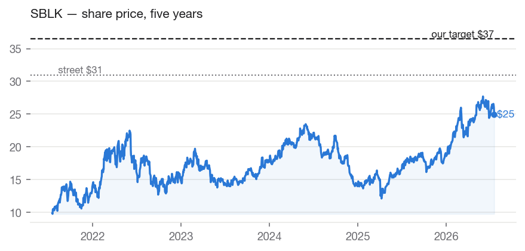
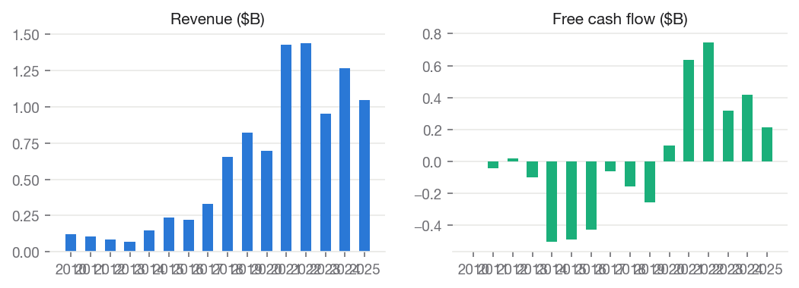
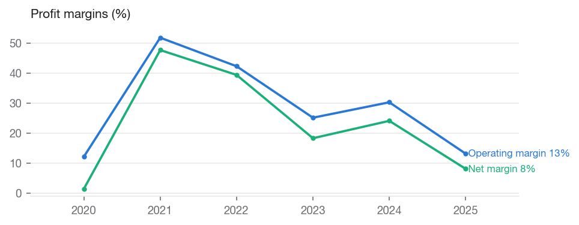
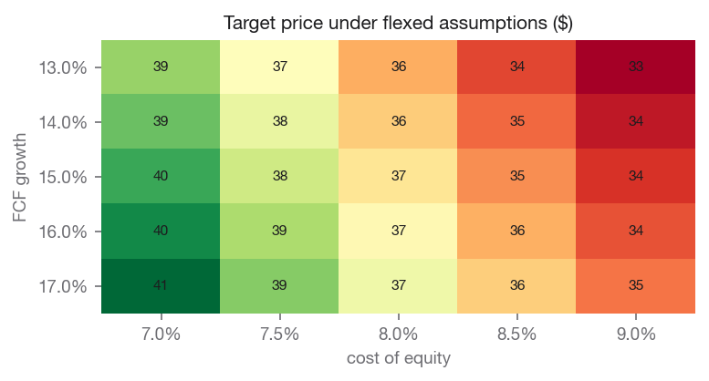

# Star Bulk Carriers Corp. (SBLK) — BUY

**Equity Research | Industrials — Marine Shipping (Dry Bulk) | 2026-07-17**

| | |
|---|---|
| Rating (absolute) | **BUY** |
| Rating (relative, within coverage) | **Top Pick** (#1 of coverage) |
| Price | $24.94 |
| Target price | **$36.53** (base model $36.53) |
| Implied upside | +46.5% |
| Street consensus target | $30.98 (5 analysts) |
| Market cap | $2.8B |
| 52-week range | $16.72 – $28.50 |
| Beta | 0.735 |
| Dividend yield | 3.96% |
| Institutional ownership | 36.3% |

## Investment Summary

We rate SBLK **BUY** with a price target of **$36.53**, against a current price of $24.94 (+46.5% implied return). Within our coverage universe, the name ranks **Top Pick**.

The target blends independent valuation lenses: discounted cash flow values the shares at $51.23; peer comparables values the shares at $28.49; own historical multiple values the shares at $24.97.

Our target sits +17.9% vs. street consensus of $30.98. The divergence is our documented view, not an input: consensus never enters the models.

## The Investment Thesis

**Initiating at BUY, $37 target: a levered bet on a firming dry bulk cycle, paid out in cash as it happens.**

- **Valuation:** our three lenses value SBLK at $51 (discounted cash
  flow on the maintenance-capex basis), $29 (peer multiples), and $25
  (its own historical multiple). Blended, they produce a $37 target
  against a $26.56 price, an implied return of +38%. Street consensus
  is about $31. The gap between our lowest and highest lens is roughly
  2x. Under our methodology, a spread that wide signals elevated
  uncertainty, so we hold the target with moderate conviction.
- **What the spread is telling you:** SBLK earns spot and short-term
  charter rates, so its results move with the dry bulk market almost
  in real time. Revenue swung from $1.44B in 2022, to $949M in 2023,
  to $1.27B in 2024, to $1.04B in 2025. The two market-based lenses
  ($25 and $29) price the company on today's soft trailing earnings.
  The cash-flow lens ($51) prices what a 136-vessel fleet generates
  across a full cycle. Which lens proves right depends on where rates
  settle, and we anchor on the market-based pair.
- **Why we lean positive:** rates have turned. The fleet earned an
  average of $18,493 per vessel per day in the first quarter of 2026,
  up from $12,439 a year earlier. Management described the strength as
  counterseasonal and broad across vessel classes. Few new ships are
  on order relative to an aging global fleet, so supply should stay
  tight. Trailing earnings therefore understate what the fleet earns
  at today's rates.
- **The kicker:** SBLK adopted a full-payout dividend policy in 2026.
  The company now distributes 100% of operating cash flow after
  capital spending and debt service. When rates are strong,
  shareholders receive the upcycle directly in cash. When rates
  weaken, the dividend will fall just as quickly. This is a cycle
  instrument by design, and we rate it as one.

## Macro & Industry Overview

**Economic backdrop (FRED, latest readings):**

| Indicator | Latest | As of | 1y ago | Change |
|---|---|---|---|---|
| Effective Federal Funds Rate (%) | 3.63 | 2026-06-01 | 4.33 | -0.70 |
| 10-Year Treasury Yield (%) | 4.55 | 2026-07-15 | 4.50 | +0.05 |
| 10Y-2Y Treasury Spread (%) | 0.41 | 2026-07-16 | 0.58 | -0.17 |
| Consumer Price Index (level) | 332.57 | 2026-06-01 | 321.44 | +11.13 |
| Unemployment Rate (%) | 4.20 | 2026-06-01 | 4.10 | +0.10 |
| U. Michigan Consumer Sentiment | 44.80 | 2026-05-01 | 52.20 | -7.40 |
| Personal Consumption Expenditures ($B) | 22,059.80 | 2026-05-01 | 20,755.00 | +1,304.80 |

Cost of equity: **8.04%** (10Y Treasury 4.55% risk-free base, CAPM).

**Macro linkages applied to this valuation** (rule-based, capped; see MACRO_CATALOG.md):

- **credit_spread_erp** [BAA10Y] — Baa spread 1.60%, -0.37pp vs 10y median. Adjustment: -0.18% to cost_of_equity. Credit spreads are a market-priced risk gauge; wider-than-normal spreads raise the equity risk premium.

## Business Description

Star Bulk Carriers Corp., a shipping company, engages in the ocean transportation of dry bulk cargoes through the ownership and operation of dry bulk carrier vessels worldwide. Its vessels transport a range of bulk commodities, including iron ores, minerals and grains, bauxite, fertilizers, and steel products. As of December 31, 2025, the company owned a fleet of 136 dry bulk vessels consisting of Newcastlemax, Capesize, Post Panamax, Kamsarmax, Panamax, Ultramax, and Supramax vessels with carrying capacities between 55,569 deadweight tonnage and 209,537 deadweight tonnage. Star Bulk Carriers Corp. was incorporated in 2006 and is based in Marousi, Greece.

### Segments and revenue drivers

SBLK operates a single business: owning and operating dry bulk carriers
that move iron ore, coal, grain, and minor bulks on spot and short-term
charters.

- **Fleet:** 136 vessels as of December 31, 2025 — one of the largest
  US-listed dry bulk fleets — spanning Supramax (~55,600 dwt) through
  Newcastlemax (~209,500 dwt), with new high-specification Kamsarmax
  newbuildings beginning delivery in 2026. Scale delivers procurement,
  operating-cost, and chartering advantages the company has
  historically converted into best-in-class daily operating expenses.
- **Rate exposure:** unlike contracted lessors (compare our GSL
  coverage: $2.05B of fixed backlog), SBLK's revenue reprices with the
  market almost immediately. Q1 2026 TCE of $18,493/day versus
  $12,439 a year prior translated directly into the earnings recovery.
- **Consolidation history:** the 2024 all-stock merger with Eagle Bulk
  added mid-size tonnage and made SBLK the sector's reference
  consolidator; management has continued to recycle older vessels into
  newer, fuel-efficient ones.
- **Capital returns:** the full-payout policy (adopted 2026)
  distributes post-debt-service operating cash flow in its entirety;
  the most recent declared dividend was $0.50 per share for the
  quarter. At current rates the annualized yield runs high single
  digits; the policy makes the dividend a direct read on the cycle
  rather than a managed number.

## Industry Overview and Competitive Positioning

- **Demand:** dry bulk ships carry the raw materials of industry —
  iron ore and coal for steel mills, grain for food, minor bulks for
  construction. Demand therefore rises and falls with global
  industrial activity, and with Chinese construction above all. One
  further driver matters: distance. When trade routes lengthen, as
  they have while ships avoid disrupted passages, each cargo occupies
  a vessel for more days. The same volume of cargo then requires more
  ships, which tightens the market even when volumes are flat.
  *Net effect: favorable today — but this is the volatile side of the
  market, and it can reverse without warning.*
- **Supply, the structural case:** few new dry bulk ships are being
  built. Ships on order equal a near multi-decade-low share of the
  fleet already sailing. Shipyards are booked with other vessel types
  into the late 2020s, so even a rush of new orders could not arrive
  quickly. Stricter emissions rules push owners to sail slower and
  scrap older ships, shrinking effective capacity further. This is
  the most durable pillar of the bull case, because it holds true no
  matter what demand does. *Net effect: positive and durable — supply
  is the reason to own shipping this decade.*
- **The honest caveat:** none of this repeals the cycle. Dry bulk
  rates are set every day by a commodity market. A Chinese
  construction downturn or a global recession would move them
  violently, and because SBLK earns spot rates, the damage would
  reach earnings within a quarter. The 2023 trough, when revenue fell
  to $949M, shows exactly how fast that happens. *Net effect: the
  defining risk of the stock — it argues for sizing the position
  modestly, not for avoiding it.*
- **Where SBLK sits:** SBLK is the largest and lowest-cost of the
  listed dry bulk owners, and its fleet is modern. That should let it
  earn more than peers at every point in the cycle. It does not
  exempt the company from the cycle itself: a better boat, same
  ocean. *Net effect: positive versus peers, neutral versus the
  cycle — SBLK is the right vehicle if you want this exposure at
  all.*

### The moat — durability of the franchise

We are explicit, as with all commodity shippers: there is no structural
moat. Vessels are commodity assets and rates are set by a global spot
market. SBLK's repeatable advantages:

- **Scale and cost:** the largest US-listed dry bulk platform, with
  historically sector-leading daily operating costs and G&A per
  vessel — in a commodity business, the low-cost operator is the
  closest thing to a moat that exists.
- **Fleet quality:** heavy investment in scrubbers and fuel-efficient
  tonnage earns premium effective rates and positions the fleet for
  tightening emissions rules.
- **Consolidator's seat:** a track record of value-accretive
  combinations (most recently Eagle Bulk, 2024) gives SBLK first call
  on future sector consolidation.

We assess the franchise as cost-advantaged but cycle-taking, and we
anchor the valuation on market-based lenses accordingly.

## Financial Analysis

### Key financials (as filed with the SEC)

| Fiscal year | 2021 | 2022 | 2023 | 2024 | 2025 |
|---|---|---|---|---|---|
| Revenue | $1.4B | $1.4B | $0.9B | $1.3B | $1.0B |
| Revenue growth | — | +0.7% | -33.9% | +33.3% | -17.6% |
| EBITDA | $0.9B | $0.8B | $0.4B | $0.5B | $0.3B |
| EBITDA margin | 62.5% | 53.2% | 39.7% | 43.2% | 29.3% |
| Operating margin | 51.8% | 42.3% | 25.1% | 30.3% | 13.1% |
| Net income | $0.7B | $0.6B | $0.2B | $0.3B | $0.1B |
| Net margin | 47.7% | 39.4% | 18.3% | 24.1% | 8.1% |
| Diluted EPS | $6.71 | $5.52 | $1.75 | $2.80 | $0.73 |
| Free cash flow | $0.6B | $0.7B | $0.3B | $0.4B | $0.2B |
| Return on equity | 32.7% | 28.0% | 10.5% | 12.3% | 3.4% |
| Shareholders' equity | $2.1B | $2.0B | $1.7B | $2.5B | $2.4B |
| Dividends paid | $0.2B | $0.7B | $0.2B | $0.3B | $0.0B |

Revenue CAGR: -10.1% (3y), +8.5% (5y). Net income CAGR (5y): +54.2%. FCF CAGR (5y): +16.6%.

## Management and Capital Allocation

- **Leadership:** CEO Petros Pappas, a four-decade shipping veteran and
  among the sector's best-regarded cycle operators, leads a management
  team with substantial insider economics; president Hamish Norton
  brings the capital-markets discipline behind the company's
  consolidation record.
- **Capital allocation:** the record shows counter-cyclical fleet
  purchases, prompt deleveraging in strong markets, and — with the
  2026 full-payout policy — a commitment to return rather than hoard
  cycle windfalls. We regard handing the reinvestment decision to
  shareholders as the correct discipline for a spot-exposed shipowner.
- **Methodology note:** our DCF uses the maintenance-capex basis
  declared for fleet owners (DECISIONS.md, GSL precedent): vessel
  purchases are growth capital, and depreciation proxies fleet upkeep.
  The disclosed bias (depreciation understates true replacement cost)
  argues for anchoring on the comps lens, which we do.

## Valuation

We value the company using several independent methods, each of which can be wrong for different reasons. Close agreement across methods increases our confidence in the blended target. A wide spread indicates the value is genuinely uncertain, and we hold the target with lower conviction accordingly. Weights: discounted cash flow 40%, peer comparables 30%, own historical multiple 30%.

### Discounted cash flow — $51.23 per share

| Assumption | Value |
|---|---|
| Fcf base | $0.3B |
| Initial growth | 15.00% |
| Terminal growth | 2.50% |
| Cost of equity | 8.04% |
| Exit multiple | 8.96 |
| Projection years | 5.00 |
| Net debt | $0.4B |
| Fcf basis | operating cash flow less depreciation (maintenance basis, declared by the sector playbook; growth capital expenditure excluded) |
| Capex to depreciation | 0.35x |

### Peer comparables — $28.49 per share

| Assumption | Value |
|---|---|
| Trailing | eps 1.25; peer median pe 14.11 |
| Forward | eps 3.59; peer median pe 10.96 |
| Peers used | GNK, SB, DSX, PANL |

### Own historical multiple — $24.97 per share

| Assumption | Value |
|---|---|
| Own avg pe 5y | 6.95 |
| Eps used | 3.59 |
| Eps basis | forward |

**Sensitivity — target price across FCF growth (rows) and cost of equity (columns):**

| FCF growth | 7.0% | 7.5% | 8.0% | 8.5% | 9.0% |
|---|---|---|---|---|---|
| 13.0% | 39 | 37 | 36 | 34 | 33 |
| 14.0% | 39 | 38 | 36 | 35 | 34 |
| 15.0% | 40 | 38 | 37 | 35 | 34 |
| 16.0% | 40 | 39 | 37 | 36 | 34 |
| 17.0% | 41 | 39 | 37 | 36 | 35 |

### DCF walk — the projection, year by year

The base free cash flow of $0.3B is measured as operating cash flow less depreciation (maintenance basis, declared by the sector playbook; growth capital expenditure excluded). Growth fades from 15.0% toward 2.5%, and each year is discounted at 8.04%.

| Year | Growth | Free cash flow | Discount factor | Present value |
|---|---|---|---|---|
| 1 | +15.0% | $0.4B | 0.926 | $0.3B |
| 2 | +11.9% | $0.4B | 0.857 | $0.3B |
| 3 | +8.8% | $0.4B | 0.793 | $0.3B |
| 4 | +5.6% | $0.5B | 0.734 | $0.3B |
| 5 | +2.5% | $0.5B | 0.679 | $0.3B |

- Sum of explicit-period value: $1.7B
- Terminal value: average of Gordon growth ($8.8B) and exit multiple ($4.3B), discounted to $4.4B (72% of total value)
- Less net debt $0.4B → equity value $5.7B → **$51.23 per share**

### Comparable companies

| Company | Mkt cap | P/E (ttm) | P/E (fwd) | EV/EBITDA | P/B | Net margin | ROE |
|---|---|---|---|---|---|---|---|
| **SBLK (subject)** | $2.8B | 20.0 | 6.9 | — | 1.1 | — | — |
| Genco Shipping & Trading Limite | $1.1B | 62.6 | 13.9 | 15.3 | 1.2 | 4.4% | 1.9% |
| Safe Bulkers, Inc | $0.7B | 15.1 | 14.5 | 8.0 | 0.8 | 18.7% | 6.4% |
| Diana Shipping inc. | $0.3B | 5.9 | 3.5 | 7.6 | 0.5 | 20.6% | 8.7% |
| Pangaea Logistics Solutions Ltd | $0.5B | 13.1 | 8.0 | 8.8 | 1.0 | 5.1% | 7.6% |

Medians of this table drive the peer-comps lens and the DCF exit multiple. Peer selection is disclosed in universe.py and versioned.

## Catalysts and What Would Change Our Mind

Key events and expected read-through:

1. **Quarterly TCE prints (next expected August 2026):** the single
   number that moves the stock. Sustained rates near or above the
   ~$18,500/day Q1 level would confirm the cycle turn and lift both
   earnings-based lenses toward our DCF; a retreat toward ~$12,000
   would validate the trailing-multiple caution.
2. **Dividend declarations under the full-payout policy:** each
   quarterly declaration is now a direct, audited disclosure of cycle
   cash flow. Rising declarations compound the income case; the first
   cut will mark the cycle top more honestly than any analyst note.
3. **China stimulus and steel demand:** iron ore and coal ton-miles
   remain the demand swing factor; construction-sector stimulus would
   be the clearest upside surprise.
4. **Newbuild deliveries and fleet sales:** Kamsarmax deliveries
   through 2026-27 add earning days; continued sales of older tonnage
   at firm secondhand values would quietly validate fleet values that
   underpin the balance sheet.
5. **Rating triggers:** we would revisit the BUY on (a) price
   convergence toward $37, (b) TCE rates rolling over toward prior-year
   levels for two consecutive quarters, or (c) a shift away from the
   full-payout policy, which would remove the discipline that
   underwrites our income argument.

## Investment Risks

- Valuation model risk: 72% of DCF value sits in the terminal period — the estimate is sensitive to terminal assumptions, as the sensitivity grid shows.

## ESG & Governance

Free primary ESG data is limited; this section reports only what can be grounded in market and filing data, and flags sector-specific exposures qualitatively.

- Institutional ownership: 36% — professional holders with governance voting power.
- Public float: 60% of shares outstanding.
- Dividend record: cash returned to shareholders in each of the last 14 fiscal years on file — a capital-discipline signal.

## Investment Conclusion

*Initiating at BUY, $37 target: a levered bet on a firming dry bulk cycle, paid out in cash as it happens.*

- **The call:** BUY. Our target is $36.53 against a current price of $24.94, an implied return of +46.5%. Street consensus stands at $30.98.
- **The evidence:** our independent lenses value the shares at $51.23, $28.49, and $24.97. The blended base case is $36.53.
- **Conviction:** moderate. The widest and narrowest lenses differ by 2.1x. Tighter agreement between independent methods means higher confidence in the target.
- **Within coverage:** ranked Top Pick, #1 among the names we cover.
- **Standing review:** we re-examine the rating at every quarterly report against the triggers listed under Catalysts. Calls and targets are logged, dated, and never rewritten.

## Disclosures

- Generated by Equity-Lens on 2026-07-17 from primary sources: SEC EDGAR (as-filed XBRL financials), Yahoo Finance (market data), FRED (macro series).
- All model values are computed deterministically; methodology is versioned in this repository. Analyst overlays are dated and disclosed in the Investment Summary.
- Street consensus figures are shown for benchmarking only and are never model inputs.
- Educational research project. Not investment advice.
